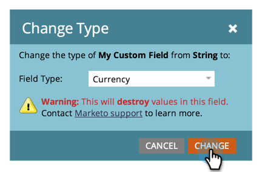

# 更改 Marketo 自定义字段的类型 {#change-the-type-of-a-marketo-custom-field}

了解如何更改自定义字段的字段类型。

1. 进入 **[!UICONTROL Admin]** 区域。

   

1. 单击 **[!UICONTROL Field Management]**。

   

1. 查找并选择所需字段。

   

1. 在&#x200B;**[!UICONTROL Field Actions]**&#x200B;下拉列表中，单击&#x200B;**[!UICONTROL Change Type]**。

   

1. 选择新类型。

   >[!NOTE]
   >
   >无法更改得分和公式字段。

   

1. 阅读警告，然后单击&#x200B;**[!UICONTROL Change]**&#x200B;确认。

   

   >[!NOTE]
   >
   >您看到的警告消息将因您从和到更改的字段类型而异。

   >[!MORELIKETHIS]
   >
   >[在Marketo中创建自定义字段](/help/marketo/product-docs/administration/field-management/create-a-custom-field-in-marketo.md)
