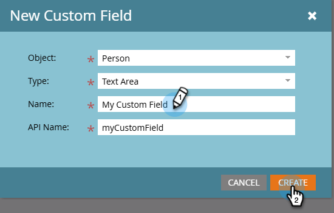

# 在Marketo中创建自定义字段 {#create-a-custom-field-in-marketo}

如果您在Marketo Engage中需要新的自定义字段来存储/捕获数据，以下提供了如何创建字段。

1. 转到&#x200B;**[!UICONTROL Admin]**&#x200B;区域。

   

1. 单击 **[!UICONTROL Field Management]**。

   

   >[!TIP]
   >
   >如果您希望字段与CRM保持同步，请在CRM中创建它们，并且这些字段将在Marketo中自动创建。

1. 单击 **[!UICONTROL New Custom Field]**。

   

1. 选择&#x200B;_[!UICONTROL Object]_。

   

   >[!NOTE]
   >
   >虽然您无法自行选择&#x200B;_公司_&#x200B;对象，但可以通过联系[Marketo支持](https://nation.marketo.com/t5/support/ct-p/Support){target="_blank"}来请求它。

1. 选择字段&#x200B;_[!UICONTROL Type]_。 这将更改它在Marketo的智能列表和表单中的呈现方式。

   >[!TIP]
   >
   >查看[自定义字段类型术语表](/help/marketo/product-docs/administration/field-management/custom-field-type-glossary.md){target="_blank"}。

   

1. 输入您希望它在Marketo中显示的&#x200B;_[!UICONTROL Name]_（自动生成_[!UICONTROL API Name]_）。 请仔细选择，因为保存后无法重命名它。 完成后单击&#x200B;**[!UICONTROL Create]**。

>[!CAUTION]
>
>字段名称不能以下列字符开头： **. &amp; +[]**

>[!NOTE]
>
>该API名称由SOAP API和其他后端进程使用。

现在，您可以在表单、流程步骤和智能列表中使用此自定义字段！
