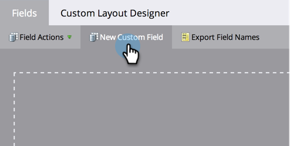

# 创建并使用串联字符串（公式）字段 {#create-and-use-a-concatenated-string-formula-field}

您可以组合多个字段中的值，或使用Marketo Engage公式字段构建条件值。

1. 转到&#x200B;**[!UICONTROL Admin]**&#x200B;区域。

   

1. 单击&#x200B;**[!UICONTROL Field Management]**。

   

1. 单击&#x200B;**[!UICONTROL New Custom Field]**。

   

1. 为&#x200B;**[!UICONTROL Type]**&#x200B;选择&#x200B;**[!UICONTROL Formula]**。

   

1. 为您的字段输入&#x200B;**[!UICONTROL Name]**，然后单击&#x200B;**[!UICONTROL Create]**。

   

1. 查找并选择公式字段，然后单击&#x200B;**[!UICONTROL Edit Rules]**。

   

1. 添加两个选项并像下面的屏幕快照一样定义它们。

   

   >[!TIP]
   >
   >了解有关流程步骤](/help/marketo/product-docs/core-marketo-concepts/smart-campaigns/flow-actions/use-tokens-in-flow-steps.md)的[令牌的更多信息。

1. 现在，您可以在电子邮件中添加公式字段作为令牌。

   

>[!NOTE]
>
>公式字段可用于登陆页面、电子邮件和智能列表列。 带有公式字段的电子邮件&#x200B;_不能_&#x200B;使用批处理营销活动发送。 在此方案中使用[电子邮件脚本令牌](/help/marketo/product-docs/email-marketing/general/using-tokens/create-an-email-script-token.md)。
