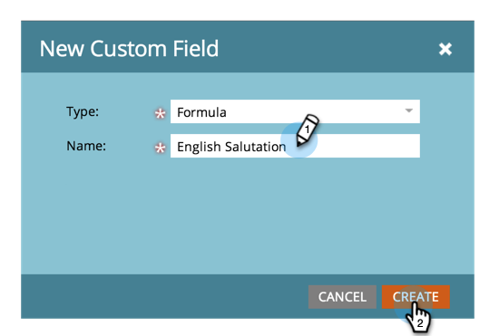

# 创建并使用串联字符串（公式）字段 {#create-and-use-a-concatenated-string-formula-field}

您可以组合多个字段中的值，或使用Marketo公式字段构建条件值。

1. 转到 **[!UICONTROL 管理员]** 区域。

   

1. 单击 **[!UICONTROL 字段管理]**.

   

1. 单击 **[!UICONTROL 新建自定义字段]**.

   

1. 选择 **[!UICONTROL 公式]** 对于 **[!UICONTROL 类型]**.

   

1. 输入 **[!UICONTROL 名称]** （对于您的字段），然后单击 **[!UICONTROL 创建]**.

   

1. 查找并选择公式字段，然后单击 **[!UICONTROL 编辑规则]**.

   

1. 添加两个选项并像下面的屏幕快照一样定义它们。

   

   >[!TIP]
   >
   >了解有关 [流程步骤的令牌](/help/marketo/product-docs/core-marketo-concepts/smart-campaigns/flow-actions/use-tokens-in-flow-steps.md).

1. 现在，您可以在电子邮件中添加公式字段作为令牌。

   

>[!NOTE]
>
>公式字段可用于登陆页面、电子邮件和智能列表列（不导出它们）。 包含公式字段的电子邮件可以 _非_ 使用批量营销活动发送。 请使用 [电子邮件脚本令牌](/help/marketo/product-docs/email-marketing/general/using-tokens/create-an-email-script-token.md) 在此方案中。

做得好！ 现在，你有一个聪明的领域，知道根据性别应该包括什么称谓。 玩得开心，发挥创意。
