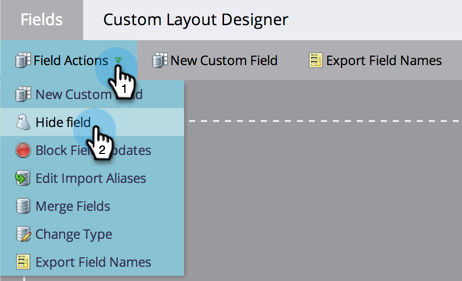

# 在 Marketo 中删除自定义字段 {#delete-a-custom-field-in-marketo}

>[!NOTE]
>
>**需要管理员权限**

如果您不再需要使用某个过去创建的字段，则可能需要删除该字段。 很遗憾，您不能删除Marketo中的字段，但您可以&#x200B;_在用户界面中_&#x200B;隐藏它们。

1. 进入 **[!UICONTROL Admin]** 区域。

   

1. 单击 **[!UICONTROL Field Management]**。

   

1. 点击 **[!UICONTROL Field Actions]** 下拉菜单，并选择 **[!UICONTROL Hide Field]**。

   

   有关详细的分步说明，请参阅[隐藏和取消隐藏字段](/help/marketo/product-docs/administration/field-management/hide-and-unhide-a-field.md)。
