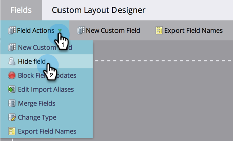

# 删除Marketo中的自定义字段 {#delete-a-custom-field-in-marketo}

>[!NOTE]
>
>**需要管理员权限**

如果您不再使用过去创建的字段，则可能需要删除该字段。 很遗憾，您无法删除Marketo中的字段，但您 _can_ 在用户界面中隐藏它们。

1. 转到 **管理员** 的上界。

   

1. 单击 **字段管理**.

   

1. 单击 **字段操作** 下拉框并选择 **隐藏字段**.

   

   有关详细的分步说明，请参阅 [隐藏和取消隐藏字段](/help/marketo/product-docs/administration/field-management/hide-and-unhide-a-field.md).
