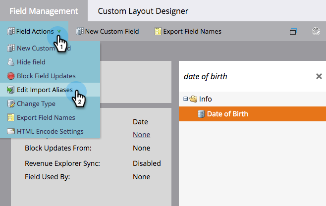

# 编辑列表导入的字段别名 {#edit-field-aliases-for-list-import}

导入带有未知标题的列表时，可以创建字段别名以简化操作。 您还可以在字段管理中编辑这些别名。 看吧。

>[!NOTE]
>
>**需要管理员权限**

1. 转到 **[!UICONTROL 管理员]** 区域。

   

1. 单击 **[!UICONTROL 字段管理]**.

   

1. 查找并选择要向其添加别名的字段。

   

1. 在 **[!UICONTROL 字段操作]** 下拉列表，单击 **[!UICONTROL 编辑导入别名]**.

   

1. 输入别名，然后单击 **[!UICONTROL 保存]**.

   

>[!TIP]
>
>单击 **[!UICONTROL 添加其他]** 并输入更多别名（如果需要）。

看那个！ 现在，如果您导入的电子表格具有名为“DOB”的列，Marketo会自动将其识别为“出生日期”，并将数据导入到正确的字段中。

