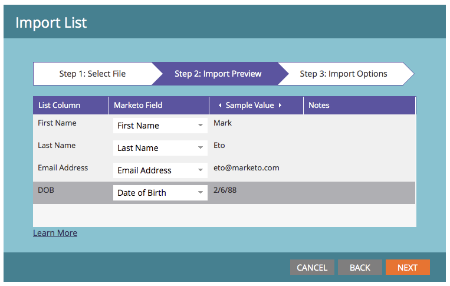

# 为列表导入编辑字段别名 {#edit-field-aliases-for-list-import}

导入带有未知标头的列表时，可以创建字段别名来简化将来的导入。 您还可以在“字段管理”中编辑这些别名。

>[!NOTE]
>
>**需要管理员权限**

1. 进入 **[!UICONTROL Admin]** 区域。

   

1. 单击 **[!UICONTROL Field Management]**。

   

1. 查找并选择要向其添加别名的字段。

   

1. 在&#x200B;**[!UICONTROL Field Actions]**&#x200B;下拉列表中，单击&#x200B;**[!UICONTROL Edit Import Aliases]**。

   

1. 输入别名并单击&#x200B;**[!UICONTROL Save]**。

   

>[!TIP]
>
>单击&#x200B;**[!UICONTROL Add Another]**，然后根据需要输入更多别名。

现在，如果您导入的电子表格具有名为“DOB”的列，Marketo会自动将其识别为“出生日期”，并将数据导入到正确的字段中。

