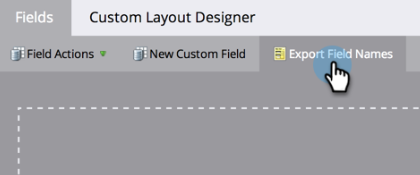

# 导出所有 Marketo API 字段名称的列表 {#export-a-list-of-all-marketo-api-field-names}

如果您使用我们的[!DNL SOAP API]或[!DNL Munchkin API]，则需要包含所有字段及其API名称的列表。 下面是如何获取此列表的。

>[!NOTE]
>
>**需要管理员权限**

1. 进入 **[!UICONTROL Admin]** 区域。

   

1. 单击 **[!UICONTROL Field Management]**。

   

1. 单击&#x200B;**[!UICONTROL Export Field Names]**&#x200B;下载电子表格。

   

太好了！ 现在，您有一个电子表格，其中包含所有字段及其API名称的列表。

>[!NOTE]
>
>MLM API名称的字符限制为255。
