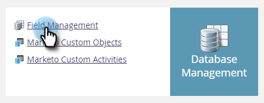

# 导出所有对象元数据 {#export-all-object-metadata}

此功能允许您导出所有对象及其元数据。

>[!NOTE]
>
>**需要管理员权限**

## 对象 {#objects}

* 潜在客户字段（人员/公司）
* Marketo 自定义对象
* 标准活动
* 自定义活动
* 渠道
* 标记

## 导出对象元数据 {#export-object-metadata}

1. 进入 **[!UICONTROL Admin]** 区域。

   

1. 单击 **[!UICONTROL Field Management]**。

   

1. 单击 **[!UICONTROL Export All Objects]**。

   

>[!NOTE]
>
>确保您的浏览器未阻止来自Marketo的弹出窗口。

数据将导出为CSV。

