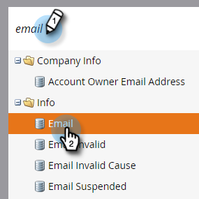

# 域{#export-used-by-data-for-a-field}的数据使用导出

作为管理员，您可以导出字段的相关资产，以便将其解除链接委派给您的团队。

>[!NOTE]
>
>**需要管理权限**

1. 单击&#x200B;**管理员**。

   

1. 单击&#x200B;**字段管理**。

   

1. 找到所需字段并将其选中。

   

1. 单击&#x200B;**字段操作**&#x200B;下拉框，然后选择&#x200B;**导出使用者**。

   

1. 将导出Excel文件。 打开它以视图其内容。

   

   >[!TIP]
   >
   >每个相关资产都是一个链接，可以单击并在Marketo中打开。
