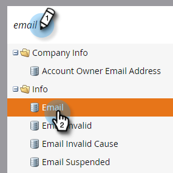
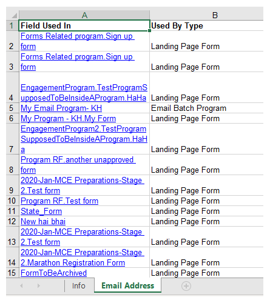

# 导出字段的“被使用”数据 {#export-used-by-data-for-a-field}

作为管理员，您可以导出字段的相关资产，以便将其取消链接委派给团队。

>[!NOTE]
>
>**需要管理员权限**

1. 进入 **[!UICONTROL Admin]** 区域。

   

1. 单击 **[!UICONTROL Field Management]**。

   

1. 找到所需的字段并将其选定。

   

1. 点击 **[!UICONTROL Field Actions]** 下拉菜单，并选择 **[!UICONTROL Export Used By]**。

   

1. [!DNL Excel]文件导出。 打开以查看其内容。

   

   >[!TIP]
   >
   >每个相关资源都是一个链接，单击该链接后，将在Marketo中将其打开。
