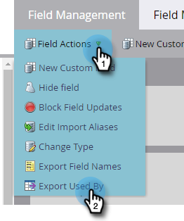

# 由字段数据使用的导出 {#export-used-by-data-for-a-field}

作为管理员，您能够导出字段的相关资产，以便将其取消链接委派给您的团队。

>[!NOTE]
>
>**需要管理员权限**

1. 转到 **管理员** 的上界。

   

1. 单击 **字段管理**.

   

1. 找到所需的字段并将其选中。

   

1. 单击 **字段操作** 下拉框并选择 **导出使用者**.

   

1. 将导出Excel文件。 打开它以查看其内容。

   

   >[!TIP]
   >
   >每个相关资产都是一个可单击的链接，该链接将在Marketo中打开。
