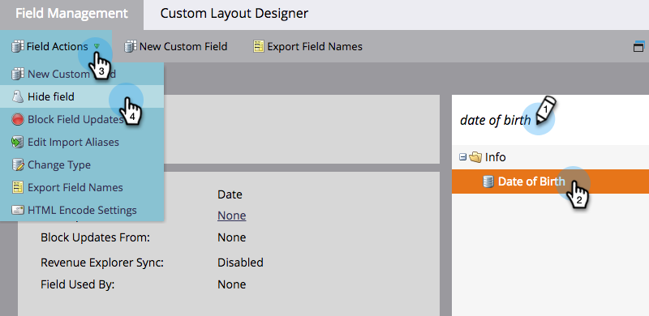
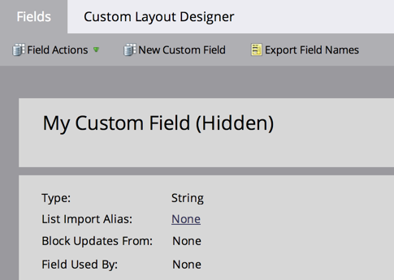

# 隐藏和取消隐藏字段 {#hide-and-unhide-a-field}

如果您不再使用Marketo中的字段，则可以在UI中隐藏该字段，以便它不再显示在应用程序中。

## 隐藏字段 {#hide-a-field}

>[!NOTE]
>
>**需要管理员权限**

1. 转到 **[!UICONTROL 管理员]** 区域。

   

1. 单击 **[!UICONTROL 字段管理]**.

   

1. 找到该字段，选择它，然后在 **[!UICONTROL 字段操作]** 单击 **[!UICONTROL 隐藏字段]**.

   

   >[!NOTE]
   >
   >要隐藏字段，该字段不得与任何其他资产（包括已存档的资产）关联。 在隐藏之前，请确保从所有智能列表、流程步骤选择、表单、电子邮件等中删除该字段。

1. 单击 **[!UICONTROL 隐藏]** 以确认。

   

   做得不错！现在您知道如何从Marketo用户界面隐藏字段了。

   

## 取消隐藏字段 {#unhide-a-field}

1. 转到 **[!UICONTROL 管理员]** 区域。

   

1. 单击 **[!UICONTROL 字段管理]**.

   

1. 查找并选择字段。 在 [!UICONTROL 字段操作] 下拉列表，单击 **[!UICONTROL 取消隐藏字段]**.

   

   做得好！ 现在您知道如何取消隐藏字段并在Marketo用户界面中再次显示它们。

   >[!TIP]
   >
   >需要执行批量隐藏/取消隐藏？ 联系Marketo专业服务：services@marketo.com。
