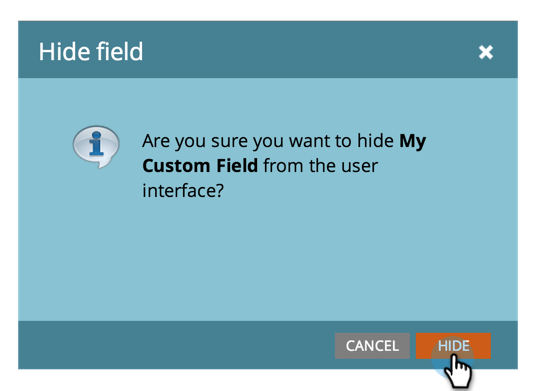

# 隐藏和取消隐藏字段{#hide-and-unhide-a-field}

如果您不再在Marketo中使用某个字段，则可以在UI中隐藏该字段，以便不再在应用程序中显示该字段。

## 隐藏字段{#hide-a-field}

>[!NOTE]
>
>**需要管理权限**

1. 转至&#x200B;**Admin**&#x200B;并单击&#x200B;**字段管理**。

   

1. 找到字段，选择它，然后在&#x200B;**字段操作**&#x200B;下单击&#x200B;**隐藏字段**。

   

   >[!NOTE]
   >
   >要隐藏字段，它不得与任何其他资产（包括存档的资产）关联。 在隐藏之前，请确保从所有智能列表、流步骤选择、表单、电子邮件等中删除该字段。

1. 单击&#x200B;**隐藏**&#x200B;进行确认。

   

   干得好！ 现在您知道如何从Marketo用户界面隐藏字段。

   

## 取消隐藏字段{#unhide-a-field}

1. 转至&#x200B;**Admin**&#x200B;并单击&#x200B;**字段管理**。

   

1. 查找并选择字段。 在“字段操作”下拉列表中，单击&#x200B;**取消隐藏字段**。

   

   干得好！ 现在您知道如何取消隐藏字段，并使它们再次在Marketo用户界面中可见。

   >[!TIP]
   >
   >需要执行大规模隐藏/取消隐藏？ 联系Marketo Professional Services:services@marketo.com。
