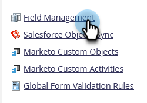

# 隐藏和取消隐藏字段 {#hide-and-unhide-a-field}

如果您不再使用Marketo Engage中的字段，则可以从UI中隐藏该字段，以便它不再显示在应用程序中。

## 隐藏字段 {#hide-a-field}

>[!NOTE]
>
>**需要管理员权限**

1. 进入 **[!UICONTROL Admin]** 区域。

   

1. 单击 **[!UICONTROL Field Management]**。

   

1. 找到该字段并选择它，然后在&#x200B;**[!UICONTROL Field Actions]**&#x200B;下单击&#x200B;**[!UICONTROL Hide Field]**。

   

   >[!NOTE]
   >
   >* 要隐藏字段，该字段不得与任何其他资产（包括已存档的资产）关联。 在隐藏之前，请确保从所有智能列表、流程步骤选择、表单、电子邮件等中删除该字段。
   >* 您不能隐藏标准（系统）字段。
   >* 无法隐藏机会信息字段。

1. 单击&#x200B;**[!UICONTROL Hide]**&#x200B;确认。

   

   做得不错！现在您知道如何从Marketo用户界面隐藏字段了。

   

## 取消隐藏字段 {#unhide-a-field}

1. 进入 **[!UICONTROL Admin]** 区域。

   

1. 单击 **[!UICONTROL Field Management]**。

   

1. 查找并选择字段。 在[!UICONTROL Field Actions]下拉列表中，单击&#x200B;**[!UICONTROL Unhide Field]**。

   

   做得好！ 现在您知道如何取消隐藏字段并使它们再次可见。
