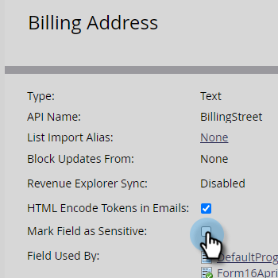

# 将字段标记为敏感 {#mark-a-field-as-sensitive}

作为Marketo管理员，您可以将特定字段标记为“敏感”，以便其值永远不会预填充表单，从而保护用户的敏感数据。

>[!NOTE]
>
>此功能将于5月11日星期二晚为所有Marketo实例启用。

1. 单击 **管理员**.

   

1. 单击 **字段管理**.

   

1. 查找并选择所需的字段。

   

1. 选择 **将字段标记为敏感** 复选框。

   

就这样！ 今后，任何启用了预填充功能的Marketo表单都不会显示选定字段的数据。
