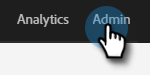
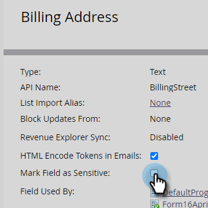

# 将字段标记为敏感 {#mark-a-field-as-sensitive}

作为Marketo管理员，您可以将特定字段标记为“敏感”，这样表单就不会预填该字段的值，进而保护用户的敏感数据。

1. 单击 **[!UICONTROL Admin]**。

   

1. 单击 **[!UICONTROL Field Management]**。

   

1. 查找并选择所需的字段。

   

1. 选中&#x200B;**[!UICONTROL Mark Field as Sensitive]**&#x200B;复选框。

   
