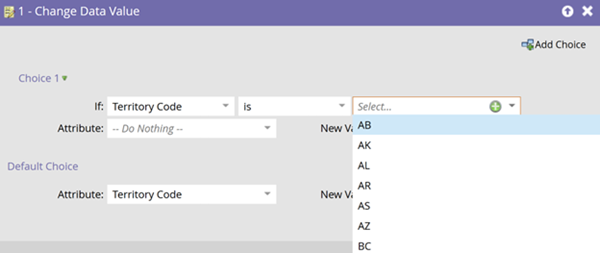
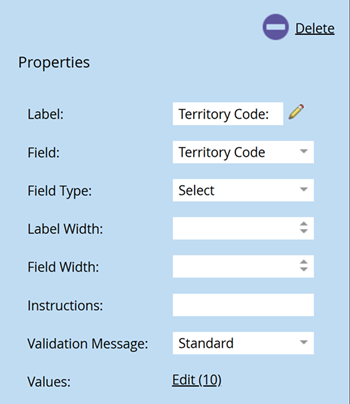

# 选取列表管理 {#picklist-management}

选择列表管理允许您为字段定义一组固定的值，以简化Marketo Engage中的数据和工作流管理。 在Marketo中，只能管理未映射到已定义选取列表的CRM字段的非文本字段。 如果字段映射到具有已定义选取列表的CRM字段，则必须在CRM中定义该字段的值。

您可以从选择列表的“字段管理”页中查看其状态。 字段可能具有以下选取列表状态之一：

* **托管**：用户定义了可自动建议用于此字段的值集。 仅自动建议在字段管理中定义的值。 如果删除了受管理的挑选列表，挑选列表状态将恢复到字段的初始值，即非托管或系统初始。

* **Unmanaged**：未定义此字段的可能值。 根据数据库中这些字段中存在的值自动建议值。

* **系统初始值**：该字段具有系统定义的值列表，向用户建议。

* **CRM**：该字段具有由CRM系统Salesforce.com或Microsoft Dynamics定义的值，该值与该实例同步。

  

## 管理选取列表 {#manage-picklist}

要修改字段的值，请转到&#x200B;**管理员** > **字段管理**&#x200B;并选择所需的字段。

单击&#x200B;_字段操作_&#x200B;下拉列表，然后选择&#x200B;**管理选择列表**。

在&#x200B;_管理选择列表_&#x200B;对话框中，您可以添加、编辑或删除值。 您还可以删除托管的选取列表，以将字段还原为其原始选取列表状态： _非托管_&#x200B;或&#x200B;_系统初始_。

每个选取列表条目都有一个“显示值”和一个“已提交值”。 显示值是构建智能列表、智能营销活动或表单时向用户建议的值，而提交的值是存储的值。 例如，您的“地区代码”用例可能在存储双字母代码(AB)时建议地区的全名（例如Alberta）。

## 自动建议 {#autosuggest}

启用&#x200B;_托管选取列表_&#x200B;设置后，筛选器、流程步骤选择和更改数据值步骤将自动从托管选取列表中建议值。 禁用此设置时，仅建议使用非托管值。

### 在受管选取列表和非受管选取列表之间切换 {#switching}

大多数Marketo Engage订阅都包含引入托管选择列表之前的数据。 要在智能列表中使用值或来自此非托管版本选择列表（例如，来自数据库中记录存在的完整值集）的流程步骤，请切换智能列表或营销活动视图中的托管选择列表设置。 打开时，仅显示受管理的选取列表值。 关闭时，会使用非托管选取列表，并根据数据库中的现有值自动建议值。

## 表单选择列表（选择类型字段） {#form-picklists}

与系统初始和CRM管理的选择列表一样，使用“选择”字段类型时，管理的选择列表的值会传播到Forms中。 对于具有托管选取列表的字段，选择该字段并将字段类型设置为&#x200B;_Select_。

这显示了为该字段定义的受管选取列表值集。

