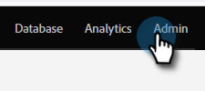

# 重命名字段 {#rename-a-field}

>[!NOTE]
>
>您可以在Marketo中重命名自定义字段。 但是，在这样做之前，必须将其在系统中的所有使用移除。 这包括表单、智能列表和智能营销活动。

>[!NOTE]
>
>**需要管理员权限**

1. 进入 **[!UICONTROL Admin]** 区域。

   

1. 单击 **[!UICONTROL Field Management]**。

   

1. 查找并选择要重命名的字段，然后单击画布中的字段名称。

   

   >[!TIP]
   >
   >单击&#x200B;**[!UICONTROL Used By]**&#x200B;链接可查找引用此字段的资源。

1. 重命名该字段并单击&#x200B;**[!UICONTROL Save]**。

   

您现在知道如何在Marketo中重命名字段了。

>[!CAUTION]
>
>如果您在[!DNL Salesforce]中重命名API名称，Marketo将创建一个全新的字段并保留旧字段。
