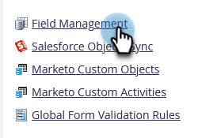

# 查看Marketo与之间的字段映射 [!DNL Salesforce] {#view-field-mappings-between-marketo-and-salesforce}

您可能想知道哪个 [!DNL Salesforce] 特定Marketo字段关联的字段。 下面是检查方法。

>[!NOTE]
>
>**需要管理员权限**

1. 转到 **[!UICONTROL 管理员]** 区域。

   

1. 单击 **[!UICONTROL 字段管理]**.

   

1. 找到您感兴趣的字段并单击 **+** 以展开映射。

   

>[!NOTE]
>
>这显示 [!DNL Salesforce] API名称，而不是标签名称。

>[!IMPORTANT]
>
>列出的字段仅反映来自初始映射的数据。 它们在Marketo/之后不会更新[!DNL Salesforce] 同步。
