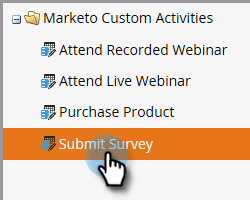

# 添加、编辑或删除Marketo自定义活动字段 {#add-edit-delete-marketo-custom-activity-fields}

了解如何添加、更改或删除自定义活动字段。

## 添加自定义活动字段 {#add-a-custom-activity-field}

1. 进入 **[!UICONTROL Admin]** 区域。

   

1. 单击 **[!UICONTROL Marketo Custom Activities]**。

   

1. 单击 **[!UICONTROL Fields]**。

   

1. 选择要向其添加字段的自定义活动。

   

1. 单击 **[!UICONTROL New Field]**。

   

1. 选择字段的[!UICONTROL data type]。

   

   >[!TIP]
   >
   >有关所有可用数据类型的定义，请参阅[本文](/help/marketo/product-docs/administration/field-management/custom-field-type-glossary.md)。

1. 命名字段。 [!UICONTROL API Name]自动填充。 完成后，单击&#x200B;**[!UICONTROL Save]**。

   

   已添加您的新字段。

## 编辑自定义活动字段 {#edit-a-custom-activity-field}

1. 进入 **[!UICONTROL Admin]** 区域。

   

1. 单击 **[!UICONTROL Marketo Custom Activities]**。

   

1. 单击 **[!UICONTROL Fields]**。

   

1. 选择包含要编辑的字段的自定义活动。

   

1. 选择要编辑的字段，单击&#x200B;**[!UICONTROL Field Actions]**&#x200B;下拉列表，然后选择&#x200B;**[!UICONTROL Edit Field]**。

   

   出现&#x200B;**[!UICONTROL Edit Field]**&#x200B;弹出窗口。 在此示例中，字段名称正在更改。

   

1. 输入新名称和[!UICONTROL API Name]，然后单击&#x200B;**[!UICONTROL Save]**。

   

   >[!NOTE]
   >
   >编辑字段时不会自动填充[!UICONTROL API Name]。 虽然字段[!UICONTROL Name]和[!UICONTROL API Name]不必匹配，但Marketo建议二者匹配。

   >[!CAUTION]
   >
   >如果自定义活动从未发布，则只能编辑[!UICONTROL API Name]或将字段更改为“主要”。

   >[!NOTE]
   >
   >如果要更改哪个字段是主字段，必须先取消选择现有字段。

字段已更新。

## 删除自定义活动字段 {#delete-a-custom-activity-field}

1. 进入 **[!UICONTROL Admin]** 区域。

   

1. 单击 **[!UICONTROL Marketo Custom Activities]**。

   

1. 单击 **[!UICONTROL Fields]**。

   

1. 选择包含要删除的字段的自定义活动。

   

1. 选择要删除的字段，单击&#x200B;**[!UICONTROL Field Actions]**&#x200B;下拉列表，然后选择&#x200B;**[!UICONTROL Delete Field]**。

   
