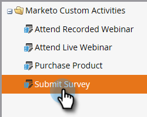
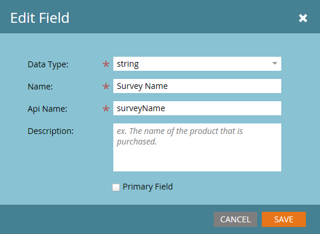

# 添加/编辑/删除Marketo自定义活动字段 {#add-edit-delete-marketo-custom-activity-fields}

您可能需要添加、更改甚至删除自定义活动字段。 这是方法。

## 添加自定义活动字段 {#add-a-custom-activity-field}

1. 转到 **管理员** 的上界。

   

1. 单击 **Marketo自定义活动**.

   

1. 单击 **字段**.

   

1. 选择要将字段添加到的自定义活动。

   

1. 单击 **新建字段**.

   

1. 选择字段的数据类型。

   

   >[!TIP]
   >
   >不确定要选择什么？ 我们掩护你！ 所有可用数据类型均在 [本文](/help/marketo/product-docs/administration/field-management/custom-field-type-glossary.md).

1. 命名字段。 Api名称会自动填充。 完成后，单击 **保存**.

   

   就这样！ 添加了新字段。

## 编辑自定义活动字段 {#edit-a-custom-activity-field}

1. 转到 **管理员** 的上界。

   

1. 单击 **Marketo自定义活动**.

   

1. 单击 **字段**.

   

1. 选择包含要编辑的字段的自定义活动。

   

1. 选择要编辑的字段，单击 **字段操作** 下拉菜单，然后选择 **编辑字段**.

   

   此时会出现“编辑字段”弹出窗口。 在本例中，让我们更改字段的名称。

   

1. 输入新名称和Api名称，然后单击 **保存**.

   

   >[!NOTE]
   >
   >编辑字段时，Api名称不会自动填充。 虽然字段名称和Api名称不必匹配，但我们建议二者匹配。

   >[!CAUTION]
   >
   >只有在自定义活动从未发布的情况下，您才能编辑Api名称或将字段更改为“主”。 如果活动已发布，则只能编辑字段的名称和可选描述。

   >[!NOTE]
   >
   >如果要更改主字段，则必须先取消选择现有字段。

您的字段现已编辑！

## 删除自定义活动字段 {#delete-a-custom-activity-field}

1. 转到 **管理员** 的上界。

   

1. 单击 **Marketo自定义活动**.

   

1. 单击 **字段**.

   

1. 选择包含要删除的字段的自定义活动。

   

1. 选择要删除的字段，单击 **字段操作** 下拉菜单，然后选择 **删除字段**.

   
