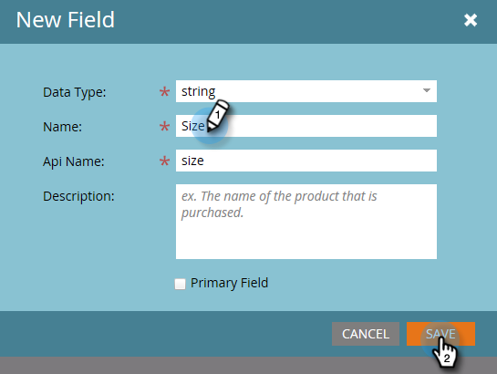

# 添加/编辑/删除Marketo自定义活动字段 {#add-edit-delete-marketo-custom-activity-fields}

您可能需要添加、更改甚至删除自定义活动字段。 下面是具体操作方法。

## 添加自定义活动字段 {#add-a-custom-activity-field}

1. 转到 **[!UICONTROL 管理员]** 区域。

   

1. 单击 **[!UICONTROL Marketo自定义活动]**.

   

1. 单击 **[!UICONTROL 字段]**.

   

1. 选择要添加字段的自定义活动。

   

1. 单击 **[!UICONTROL 新建字段]**.

   

1. 选择字段的 [!UICONTROL 数据类型].

   

   >[!TIP]
   >
   >不确定要选择什么？ 我们为您提供保护！ 所有可用数据类型均定义于 [本文](/help/marketo/product-docs/administration/field-management/custom-field-type-glossary.md).

1. 为字段命名。 Api名称会自动填充。 完成后，单击 **[!UICONTROL 保存]**.

   

   就是这样！ 已添加您的新字段。

## 编辑自定义活动字段 {#edit-a-custom-activity-field}

1. 转到 **[!UICONTROL 管理员]** 区域。

   

1. 单击 **[!UICONTROL Marketo自定义活动]**.

   

1. 单击 **[!UICONTROL 字段]**.

   

1. 选择包含要编辑的字段的自定义活动。

   

1. 选择要编辑的字段，单击 **[!UICONTROL 字段操作]** 下拉列表，然后选择 **[!UICONTROL 编辑字段]**.

   

   此时会出现“编辑字段”弹出窗口。 在此示例中，让我们更改字段的名称。

   

1. 输入新的名称和Api名称，然后单击 **[!UICONTROL 保存]**.

   

   >[!NOTE]
   >
   >编辑字段时，API名称不会自动填充。 虽然字段名称和API名称不必匹配，但我们建议它们相匹配。

   >[!CAUTION]
   >
   >如果自定义活动从未发布，则只能编辑Api名称或将字段更改为“主要”。

   >[!NOTE]
   >
   >如果要更改哪个字段是主字段，则必须首先取消选择现有字段。

您的字段现在已编辑！

## 删除自定义活动字段 {#delete-a-custom-activity-field}

1. 转到 **[!UICONTROL 管理员]** 区域。

   

1. 单击 **[!UICONTROL Marketo自定义活动]**.

   

1. 单击 **[!UICONTROL 字段]**.

   

1. 选择包含要删除的字段的自定义活动。

   

1. 选择要删除的字段，单击 **[!UICONTROL 字段操作]** 下拉列表，然后选择 **[!UICONTROL 删除字段]**.

   
