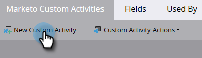

# 创建自定义活动 {#create-a-custom-activity}

按照以下步骤创建新的自定义活动。

>[!NOTE]
>
>大多数订阅都分配了10种自定义活动类型的限制。

1. 转到 **[!UICONTROL 管理员]** 区域。

   

1. 单击 **[!UICONTROL Marketo自定义活动]**.

   

1. 单击 **[!UICONTROL 新建自定义活动]**.

   

1. 输入名称和可选 [!UICONTROL 描述]，然后单击 **[!UICONTROL 下一个]**. API名称会自动填充，但可以自定义。

   

   >[!CAUTION]
   >
   >如果您决定更改API名称，请确保该名称不会与其他自定义活动中的字段冲突。

1. 定义 [!UICONTROL 筛选条件] 和 [!UICONTROL 触发器] 并单击 **[!UICONTROL 下一个]**.

   

1. 为主字段提供一个名称，该名称汇总了自定义活动的用途。

   

>[!MORELIKETHIS]
>
>[了解自定义活动](/help/marketo/product-docs/administration/marketo-custom-activities/understanding-custom-activities.md)
