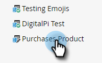

# 自定义活动元数据导出 {#custom-activity-metadata-export}

按照以下步骤导出自定义活动元数据架构。

1. 在“我的Marketo”中，单击 **[!UICONTROL 管理员]**.

   

1. 单击 **[!UICONTROL Marketo自定义活动]**.

   

1. 选择要导出的Marketo自定义活动。

   

1. 单击 **[!UICONTROL 自定义活动操作]** 下拉菜单并选择 **[!UICONTROL 导出活动]**.

   

>[!NOTE]
>
>自定义活动必须处于“已批准”状态才能导出。

现在，您有一个包含自定义活动架构的电子表格，它横跨三个选项卡。
