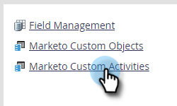

# 自定义活动元数据导出 {#custom-activity-metadata-export}

请按照以下步骤导出自定义活动元数据架构。

1. 在我的Marketo中，单击 **管理员**.

   

1. 单击 **Marketo自定义活动**.

   

1. 选择要导出的Marketo自定义活动。

   

1. 单击 **自定义活动操作** 下拉框并选择 **导出活动**.

   

>[!NOTE]
>
>自定义活动必须处于“已批准”状态才能导出。

您现在有一个电子表格，其中包含自定义活动的架构，位于三个选项卡中。
