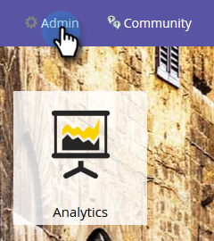

# 编辑自定义活动 {#edit-a-custom-activity}

需要对已创建的自定义活动进行更改？ 这是方法。

1. 单击 **管理员**.

   

1. 在 **数据库管理** 单击 **自定义活动**.

   

1. 选择要编辑的自定义活动。

   

1. 单击 **自定义活动操作** 选择 **编辑活动**.

   

   此时会显示“编辑活动类型”。 在本例中，我们正在修复一个打字错误。

   

1. 输入新信息并单击 **提交**.

   

   您的自定义活动现已编辑！

   >[!NOTE]
   >
   >如果您的活动在编辑时是草稿，则它仍为草稿。 如果已发布，则状态将更改为“已发布并草稿”。
