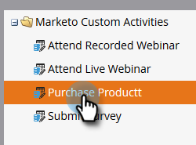
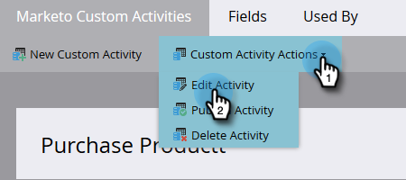

# 编辑自定义活动 {#edit-a-custom-activity}

是否需要对已创建的自定义活动进行更改？ 操作方法如下：

1. 进入 **[!UICONTROL Admin]** 区域。

   

1. 单击 **[!UICONTROL Marketo Custom Activities]**。

   

1. 选择要编辑的自定义活动。

   

1. 单击&#x200B;**[!UICONTROL Custom Activity Actions]**&#x200B;并选择&#x200B;**[!UICONTROL Edit Activity]**。

   

   此时会显示“编辑活动类型”。 在本例中，我们修复了一个打字错误。

   

1. 输入您的新信息并单击&#x200B;**[!UICONTROL Submit]**。

   

   您的自定义活动现在已编辑！

   >[!NOTE]
   >
   >如果在编辑时您的活动是草稿，则它仍为草稿。 如果已发布，则状态将更改为已发布并带有草稿。
