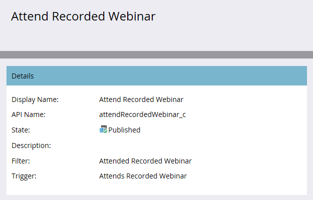

# 发布自定义活动{#publish-a-custom-activity}

您的自定义活动完全符合您的需要。 现在，是时候发布它了！

1. 单击&#x200B;**管理员**。

   

1. 在&#x200B;**数据库管理**&#x200B;中，单击&#x200B;**Marketo自定义活动**。

   

1. 选择要发布的自定义活动。

   

1. 单击&#x200B;**自定义活动操作**&#x200B;下拉框并选择&#x200B;**发布活动**。

   

   您将看到自定义活动的状态从草稿……

   

   ...。

   

   干得好！
