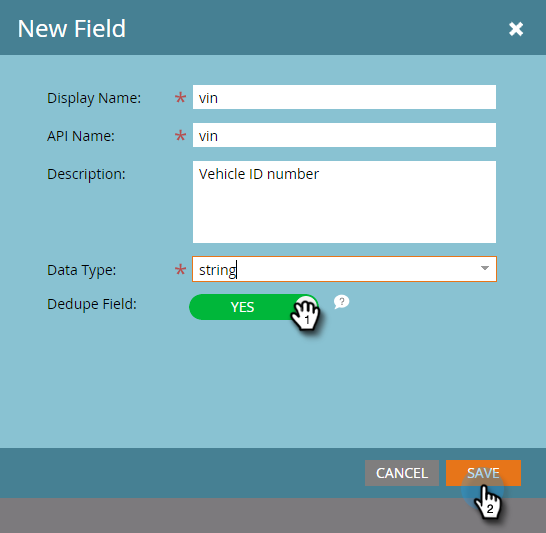

# 添加Marketo自定义对象字段{#add-marketo-custom-object-fields}

创建自定义对象后，您需要向其中添加字段以满足您的业务需求。

字段定义自定义对象使用的特定信息。 链接字段具有连接自定义对象的特殊作业，并在[单独的文章](/help/marketo/product-docs/administration/marketo-custom-objects/add-marketo-custom-object-link-fields.md)中介绍。

1. 单击&#x200B;**Admin**，在&#x200B;**Database Management**&#x200B;中，选择&#x200B;**Marketo Custom Objects**。

   

1. 选择要在右侧添加字段的对象。

   

1. 在&#x200B;**字段**&#x200B;选项卡中，单击&#x200B;**新建字段**。

   

   >[!NOTE]
   >
   >上面显示的三个字段由Marketo在创建自定义对象时自动创建。 Marketo会自动管理这些字段，您无法编辑或删除它们。

1. 输入显示名称和说明。

   

   >[!NOTE]
   >
   >API名称只能编辑，直到获得批准。

1. 现在，从列表中选择适当的数据类型。

   

1. 如果要将新字段用作唯一标识符，请将重复数据消除滑块拉到上方。 单击&#x200B;**保存**&#x200B;以完成。

   

   >[!TIP]
   >
   >重复数据消除字段可用于检索、更新或删除自定义对象。 每个自定义对象定义必须至少包含一个（且不超过三个）重复数据消除字段。

1. 添加您需要的任何其他字段。

   >[!NOTE]
   >
   >如果要构建一对多结构，则需要向自定义对象添加一个“链接”字段。 对于多对多结构，您不需要自定义对象中的链接字段，但必须在中间对象中添加两个链接字段。 请参阅[添加Marketo自定义对象链接字段](/help/marketo/product-docs/administration/marketo-custom-objects/add-marketo-custom-object-fields.md)以创建链接字段，和[了解Marketo自定义对象](/help/marketo/product-docs/administration/marketo-custom-objects/understanding-marketo-custom-objects.md)以了解有关自定义对象类型的详细信息。

>[!MORELIKETHIS]
>
>* [添加Marketo自定义对象链接字段](/help/marketo/product-docs/administration/marketo-custom-objects/add-marketo-custom-object-link-fields.md)
>* [编辑和删除Marketo自定义对象](/help/marketo/product-docs/administration/marketo-custom-objects/edit-and-delete-a-marketo-custom-object.md)
>* [编辑和删除Marketo自定义对象字段](/help/marketo/product-docs/administration/marketo-custom-objects/edit-and-delete-marketo-custom-object-fields.md)
>* [了解Marketo自定义对象](/help/marketo/product-docs/administration/marketo-custom-objects/understanding-marketo-custom-objects.md)

