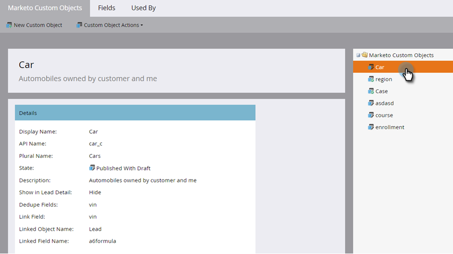

# 添加 Marketo 自定义对象字段 {#add-marketo-custom-object-fields}

创建自定义对象后，您需要向其添加字段以满足业务需求。

字段定义自定义对象使用的特定信息。 链接字段具有连接自定义对象的特殊作业，并在[单独的文章](/help/marketo/product-docs/administration/marketo-custom-objects/add-marketo-custom-object-link-fields.md)中介绍。

1. 进入 **[!UICONTROL Admin]** 区域。

   

1. 单击 **[!UICONTROL Marketo Custom Objects]**。

   

1. 选择您要向右侧的添加字段的对象。

   

1. 单击&#x200B;**[!UICONTROL Fields]**&#x200B;选项卡，然后单击&#x200B;**[!UICONTROL New Field]**。

   

   >[!NOTE]
   >
   >在您创建自定义对象时，Marketo会自动创建以上显示的三个字段。 Marketo会自动管理这些字段，您无法编辑或删除它们。

1. 输入[!UICONTROL Display Name]和（可选） [!UICONTROL Description]。

   

   >[!NOTE]
   >
   >[!UICONTROL API Name]仅可在获得批准之前进行编辑。

1. 现在，从列表中选择适当的[!UICONTROL Data Type]。

   

1. 如果要使用新字段作为唯一标识符，请将[!UICONTROL Dedupe]滑块拖动过来。 单击&#x200B;**[!UICONTROL Save]**&#x200B;完成。

   

   >[!TIP]
   >
   >重复数据删除字段可用于检索、更新或删除自定义对象。 每个自定义对象定义都必须包含至少一个（但不超过三个）重复数据消除字段。

1. 添加您需要的任何其他字段。

   >[!NOTE]
   >
   >如果您正在构建一对多结构，则需要将链接字段添加到自定义对象。 对于多对多结构，自定义对象中不需要链接字段，但必须在中间对象中添加两个链接字段。 有关自定义对象类型的更多信息，请参阅[添加Marketo自定义对象链接字段](/help/marketo/product-docs/administration/marketo-custom-objects/add-marketo-custom-object-fields.md)以创建链接字段，以及[了解Marketo自定义对象](/help/marketo/product-docs/administration/marketo-custom-objects/understanding-marketo-custom-objects.md)。

>[!MORELIKETHIS]
>
>* [添加Marketo自定义对象链接字段](/help/marketo/product-docs/administration/marketo-custom-objects/add-marketo-custom-object-link-fields.md)
>* [编辑和删除Marketo自定义对象](/help/marketo/product-docs/administration/marketo-custom-objects/edit-and-delete-a-marketo-custom-object.md)
>* [编辑和删除Marketo自定义对象字段](/help/marketo/product-docs/administration/marketo-custom-objects/edit-and-delete-marketo-custom-object-fields.md)
>* [了解Marketo自定义对象](/help/marketo/product-docs/administration/marketo-custom-objects/understanding-marketo-custom-objects.md)
