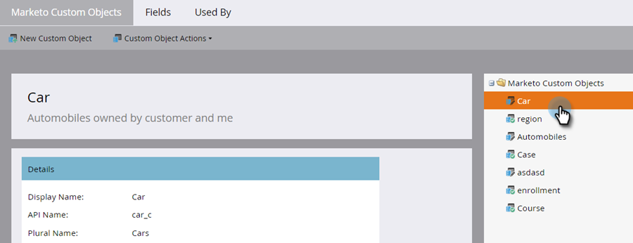

# 添加Marketo自定义对象链接字段 {#add-marketo-custom-object-link-fields}

创建自定义对象时，必须提供链接字段以将自定义对象记录连接到正确的父记录。

* 对于一对多自定义结构，使用自定义对象中的链接字段将其连接到人员或公司。
* 对于多对多结构，使用两个链接字段，它们通过单独创建的中间对象（也是一种自定义对象）连接。 一个链接连接到数据库中的人员或公司，另一个链接连接到自定义对象。 在这种情况下，链接字段不在自定义对象本身中。

## 为一对多结构创建链接字段 {#create-a-link-field-for-a-one-to-many-structure}

以下说明如何在自定义对象中为一对多结构创建链接字段。

1. 转到 **[!UICONTROL 管理员]** 区域。

   

1. 单击 **[!UICONTROL Marketo自定义对象]**.

   

1. 在列表中选择自定义对象。

   

1. 在 **[!UICONTROL 字段]** 选项卡，单击 **[!UICONTROL 新建字段]**.

   

1. 命名链接字段并添加一个可选字段 [!UICONTROL 描述]. 请务必选择 [!UICONTROL 链接] 数据类型。

   

   >[!CAUTION]
   >
   >您将无法返回并创建、编辑或删除 [!UICONTROL 链接] 或 [!UICONTROL 重复数据消除字段] 批准自定义对象后。

1. 选择是否 [!UICONTROL 链接对象] 对于 [!UICONTROL 商机] （人员）或 [!UICONTROL 公司].

   

   >[!NOTE]
   >
   >如果您选择 [!UICONTROL 商机]，您将在列表中看到ID、电子邮件地址和任何自定义字段。
   >
   >如果您选择 [!UICONTROL 公司]，您将在列表中看到ID和任何自定义字段。

1. 选择 [!UICONTROL 链接字段] 您希望作为新字段的父级连接到。

   

   >[!NOTE]
   >
   >链接字段仅支持字符串字段类型。

1. 单击 **[!UICONTROL 保存]**.

   

## 为多对多结构创建链接字段 {#create-a-link-field-for-a-many-to-many-structure}

下面介绍如何在中间对象中创建用于多对多结构的链接字段。

>[!PREREQUISITES]
>
>您必须已创建中间对象以及要将其链接到的任何自定义对象。

1. 转到 **[!UICONTROL 管理员]** 区域。

   

1. 单击 **[!UICONTROL Marketo自定义对象]**.

   

1. 选择要将字段添加到的中间对象。

   

1. 在 **[!UICONTROL 字段]** 选项卡，单击 **[!UICONTROL 新建字段]**.

   

1. 您需要创建两个链接字段。 逐个创建它们。 首先，将数据库列表成员的字段命名为（例如，leadID）。 添加可选 [!UICONTROL 描述]. 请务必选择 [!UICONTROL 链接] [!UICONTROL 数据类型].

   

   >[!CAUTION]
   >
   >您将无法返回并创建、编辑或删除 [!UICONTROL 链接] 或 [!UICONTROL 重复数据消除字段] 批准自定义对象后。

1. 选择 [!UICONTROL 链接对象] 数据库中的URL值；在本例中， [!UICONTROL 商机].

   

1. 选择 [!UICONTROL 链接字段] 你想连接，在这个例子中， [!UICONTROL Id].

   

   >[!NOTE]
   >
   >中仅支持字符串字段类型 [!UICONTROL 链接字段].

1. 单击 **[!UICONTROL 保存]**.

   

1. 对指向自定义对象的第二个链接（在本例中为courseID）重复此过程。 此 [!UICONTROL 链接对象] 名称将为课程，并且 [!UICONTROL 链接字段] 将成为courseID。 由于您已经创建和批准课程自定义对象，因此可在下拉菜单中进行这些选择。

   

1. 创建要在中间对象中使用的任何其他字段，例如enrollmentID或级别。

## 使用自定义对象 {#using-custom-objects}

下一步是在智能营销策划的过滤器中使用这些自定义对象。 通过多对多关系，您可以选择多个人员/公司和多个自定义对象。 在下面的示例中，将列出数据库中符合这些条件的所有人员。 课程名称字段来自课程自定义对象，注册级别来自中间对象。

>[!MORELIKETHIS]
>
>* [添加Marketo自定义对象字段](/help/marketo/product-docs/administration/marketo-custom-objects/add-marketo-custom-object-fields.md)
>* [编辑和删除Marketo自定义对象](/help/marketo/product-docs/administration/marketo-custom-objects/edit-and-delete-a-marketo-custom-object.md)
>* [了解Marketo自定义对象](/help/marketo/product-docs/administration/marketo-custom-objects/understanding-marketo-custom-objects.md)
>* [编辑和删除Marketo自定义对象字段](/help/marketo/product-docs/administration/marketo-custom-objects/edit-and-delete-marketo-custom-object-fields.md)
