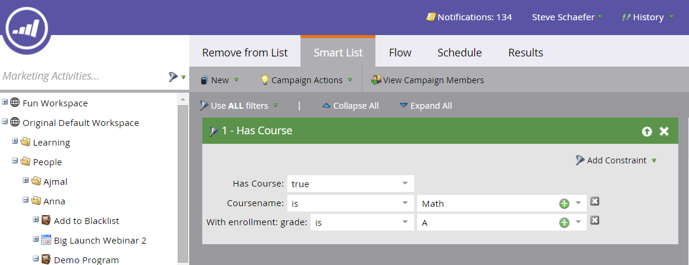

# 添加Marketo自定义对象链接字段{#add-marketo-custom-object-link-fields}

创建自定义对象时，必须提供链接字段，以将自定义对象记录连接到正确的父记录。

* 对于一对多自定义结构，请使用自定义对象中的链接字段将其连接到个人或公司。
* 对于多对多结构，您使用两个链接字段，它们与单独创建的中间对象（也是自定义对象的类型）连接。 一个链接连接到数据库中的人员或公司，另一个链接连接到自定义对象。 在这种情况下，链接字段不位于自定义对象本身中。

## 为一对多结构{#create-a-link-field-for-a-one-to-many-structure}创建链接字段

下面介绍如何为一对多结构在自定义对象中创建链接字段。

1. 单击&#x200B;**Admin**，在&#x200B;**Database Management**&#x200B;中，选择&#x200B;**Marketo Custom Objects**。

   

1. 在列表中选择自定义对象。

   

1. 在&#x200B;**字段**&#x200B;选项卡中，单击&#x200B;**新建字段**。

   

1. 命名链接字段并添加可选描述。 请务必选择链接数据类型。

   

   >[!CAUTION]
   >
   >在批准自定义对象后，您将无法返回并创建、编辑或删除链接或重复数据消除字段。

1. 选择链接对象是潜在客户（人）还是公司。

   

   >[!NOTE]
   >
   >如果您选择潜在客户，您将在列表中看到ID、电子邮件地址和任何自定义字段。
   >
   >如果选择公司，您将在列表中看到Id和任何自定义字段。

1. 选择要连接的链接字段作为新字段的父字段。

   

   >[!NOTE]
   >
   >链接字段中仅支持字符串字段类型。

1. 单击&#x200B;**保存。**

   

## 为多对多结构{#create-a-link-field-for-a-many-to-many-structure}创建链接字段

下面介绍如何在中间对象中创建链接字段以用于多对多结构。

>[!PREREQUISITES]
>
>您必须已经创建了中间对象以及要将其链接到的任何自定义对象。

1. 单击&#x200B;**Admin**，在&#x200B;**Database Management**&#x200B;中，选择&#x200B;**Marketo Custom Objects**。

   

1. 选择要将字段添加到的中间对象。

   

1. 在&#x200B;**字段**&#x200B;选项卡中，单击&#x200B;**新建字段**。

   

1. 您需要创建两个链接字段。 一次创建一个。 首先，为数据库列表成员的字段命名（例如，leadID）。 添加可选描述。 请务必选择链接数据类型。

   

   >[!CAUTION]
   >
   >在批准自定义对象后，您将无法返回并创建、编辑或删除链接或重复数据消除字段。

1. 从数据库中选择链接对象，在此例中为潜在客户。

   

1. 选择要连接到的链接字段，在此示例中为Id。

   

   >[!NOTE]
   >
   >链接字段中仅支持字符串字段类型。

1. 单击&#x200B;**保存。**

   

1. 在此示例中，为指向自定义对象的第二个链接重复此过程，课程ID。 链接对象名称将是课程，链接字段将是courseID。 由于您已创建并批准课程自定义对象，因此这些选项可在下拉菜单中使用。

   

1. 创建要在中间对象中使用的任何其他字段，如engromentID或grade。

## 使用自定义对象{#using-custom-objects}

下一步是在智能活动的过滤器中使用这些自定义对象。 通过多对多关系，您可以选择多个人/公司和多个自定义对象。 在以下示例中，将列出数据库中符合这些条件的任何人。 coursename字段来自课程自定义对象，而注册级别来自中间对象。

>[!MORELIKETHIS]
>
>* [添加Marketo自定义对象字段](/help/marketo/product-docs/administration/marketo-custom-objects/add-marketo-custom-object-fields.md)
>* [编辑和删除Marketo自定义对象](/help/marketo/product-docs/administration/marketo-custom-objects/edit-and-delete-a-marketo-custom-object.md)
>* [了解Marketo自定义对象](/help/marketo/product-docs/administration/marketo-custom-objects/understanding-marketo-custom-objects.md)
>* [编辑和删除Marketo自定义对象字段](/help/marketo/product-docs/administration/marketo-custom-objects/edit-and-delete-marketo-custom-object-fields.md)

