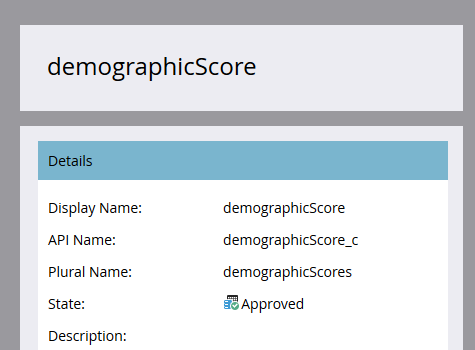

# 批准自定义对象 {#approve-a-custom-object}

您必须先批准自定义对象，然后才能使用它。 对于新自定义对象和您编辑的自定义对象，此过程稍有不同。

## 批准新的自定义对象 {#approve-a-new-custom-object}

您已创建一个全新的自定义对象。 下面是如何批准它的。

1. 转到 **[!UICONTROL 管理员]** 区域。

   

1. 单击 **[!UICONTROL Marketo自定义对象]**.

   

1. 选择处于草稿状态的对象。

   

1. 单击 **[!UICONTROL 自定义对象操作]** 下拉菜单并选择 **[!UICONTROL 批准对象]**.

   

1. 状态更改为 [!UICONTROL 已批准].

   

   >[!NOTE]
   >
   >中使用的自定义对象 _一对多结构_ 必须至少有一个要批准的重复数据删除字段、链接字段、链接对象名称和链接字段名称。
   >
   >中使用的自定义对象 _多对多结构_ **不会** 批准链接对象时需要链接字段、链接对象名称或链接字段名称（因为它们位于中间对象中）。
   >
   >用作的自定义对象 _中间对象_ 需要链接字段、链接对象名称和链接字段名称，但是 **不会** 需要重复数据消除字段。
   >
   >参见 [了解Marketo自定义对象](/help/marketo/product-docs/administration/marketo-custom-objects/understanding-marketo-custom-objects.md) 了解更多信息。

就是这样！ 现在，您可以在筛选器和触发器的限制中选择自定义对象以在营销活动中使用。

## 批准已编辑的自定义对象 {#approve-an-edited-custom-object}

编辑已批准的自定义对象后，必须批准草稿才能将自定义对象恢复到“已批准”状态。

1. 编辑已批准的自定义对象时，它将收到 [!UICONTROL 已审批，草稿] 省/州。

   

1. 准备好批准草稿后，单击 **[!UICONTROL 自定义对象操作]** 下拉菜单并选择 **[!UICONTROL 批准对象]**.

   

1. 预览显示草稿中更改的项目。 单击 **[!UICONTROL 批准]**.

   
