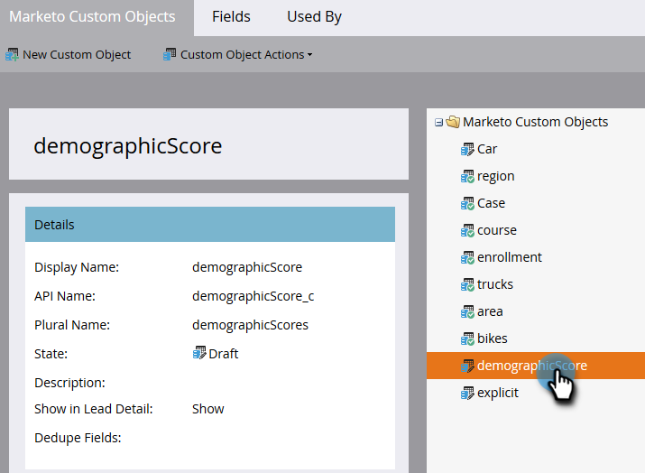
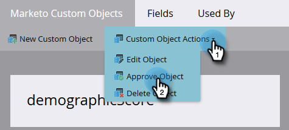

# 批准自定义对象 {#approve-a-custom-object}

您必须先批准自定义对象，然后才能使用它。 新自定义对象和您编辑的自定义对象的处理过程略有不同。

## 批准新的自定义对象 {#approve-a-new-custom-object}

已创建新的自定义对象。 请按照以下步骤批准它。

1. 进入 **[!UICONTROL Admin]** 区域。

   

1. 单击 **[!UICONTROL Marketo Custom Objects]**。

   

1. 选择处于“草稿”状态的对象。

   

1. 点击 **[!UICONTROL Custom Object Actions]** 下拉菜单，并选择 **[!UICONTROL Approve Object]**。

   

1. 状态更改为[!UICONTROL Approved]。

   

   >[!NOTE]
   >
   >在&#x200B;_一对多结构_&#x200B;中使用的自定义对象必须具有至少一个要批准的重复数据删除字段、链接字段、链接对象名称和链接字段名称。
   >
   >在&#x200B;_多对多结构_ **中使用的自定义对象在批准时**&#x200B;不需要链接字段、链接对象名称或链接字段名称（因为它们驻留在中间对象中）。
   >
   >用作&#x200B;_中间对象_&#x200B;的自定义对象需要链接字段、链接对象名称和链接字段名称，但&#x200B;**不**&#x200B;需要重复数据删除字段。
   >
   >有关详细信息，请参阅[了解Marketo自定义对象](/help/marketo/product-docs/administration/marketo-custom-objects/understanding-marketo-custom-objects.md)。

现在，您可以在筛选器和触发器的限制中选择自定义对象以在营销活动中使用。

## 批准已编辑的自定义对象 {#approve-an-edited-custom-object}

编辑已批准的自定义对象后，必须批准草稿才能将自定义对象恢复到“已批准”状态。

1. 编辑已批准的自定义对象时，它将接收[!UICONTROL Approved with Draft]状态。

   

1. 准备好批准草稿后，单击&#x200B;**[!UICONTROL Custom Object Actions]**&#x200B;下拉菜单并选择&#x200B;**[!UICONTROL Approve Object]**。

   

1. 预览显示草稿中更改的项目。 单击 **[!UICONTROL Approve]**。

   
