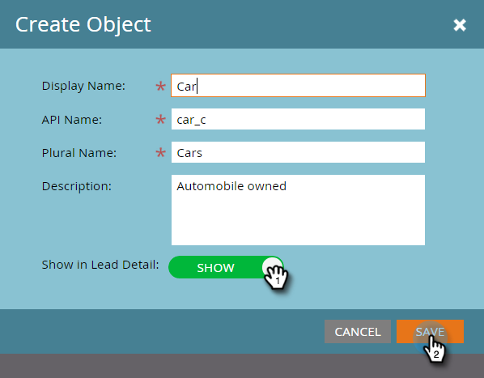

# 创建Marketo自定义对象 {#create-marketo-custom-objects}

使用Marketo中的自定义对象来跟踪特定于您的业务的量度。 这可以是汽车、课程，也可以是您希望在Marketo中建模以运行营销活动的任何内容。

>[!NOTE]
>
>您可以设置自定义对象以一对多或多对多方式工作。 创建初始对象的方式相同，但开始向对象添加字段时的步骤不同。 参见  [了解Marketo自定义对象](/help/marketo/product-docs/administration/marketo-custom-objects/understanding-marketo-custom-objects.md) 了解更多信息。

>[!NOTE]
>
>在自定义对象获得批准后，您将无法创建、编辑或删除链接或重复数据消除字段。

## 为一对多结构创建自定义对象 {#create-a-custom-object-for-a-one-to-many-structure}

此示例显示了一个Car自定义对象，用于一对多结构。 之后，您将创建一个课程自定义对象和一个中间对象以用于多对多结构。

1. 转到 **[!UICONTROL 管理员]** 区域。

   

1. 单击 **[!UICONTROL Marketo自定义对象]**.

   

1. 单击 **[!UICONTROL 新建自定义对象]**.

   

   >[!NOTE]
   >
   >此 [!UICONTROL Marketo自定义对象] 选项卡在右侧显示所有自定义对象，以及任何已批准对象的详细信息，包括最近更新的记录数量和字段。

1. 输入 [!UICONTROL 显示名称]. 此 [!UICONTROL API名称] 和 [!UICONTROL 复数名称] 自动填充。 输入 [!UICONTROL 描述] （可选）。

   

   >[!NOTE]
   >
   >您可以在创建这些字段时对其进行编辑，但在保存之后，您只能编辑 [!UICONTROL 复数名称] 字段和 **[!UICONTROL 在潜在客户详细信息中显示]** 滑块。

1. 提取 **[!UICONTROL 在潜在客户详细信息中显示]** 滑杆移过以显示 **[!UICONTROL 显示]** 如果要查看“数据库”页上的自定义对象数据。 单击 **[!UICONTROL 保存]**.

   

1. 自定义对象信息显示您输入的内容。 请注意，它处于“草稿”状态。

   

   下一步是将字段添加到 [构建您的自定义对象](/help/marketo/product-docs/administration/marketo-custom-objects/add-marketo-custom-object-fields.md).

   >[!NOTE]
   >
   >Marketo您只能通过列表导入或 [API](https://developers.marketo.com/documentation/rest/).

## 为多对多结构创建自定义对象 {#create-a-custom-object-for-a-many-to-many-structure}

此示例显示了一个课程自定义对象，您将使用该对象在人员/公司和课程之间创建多对多关系。 完成后，您将创建一个中间对象以将其连接到数据库中的人员或公司。

>[!NOTE]
>
>对于多对多关系，您无需在自定义对象中创建链接。 而是要向中间对象添加两个链接（见下文）。

1. 转到 **[!UICONTROL 管理员]** 区域。

   

1. 单击 **[!UICONTROL Marketo自定义对象]**.

   

1. 单击 **[!UICONTROL 新建自定义对象]**.

   

1. 输入 [!UICONTROL 显示名称]. 此 [!UICONTROL API名称] 和 [!UICONTROL 复数名称] 自动填充。 输入 [!UICONTROL 描述] （可选）。

   

   >[!NOTE]
   >
   >您可以在创建这些字段时对其进行编辑，但在保存之后，您只能编辑 [!UICONTROL 复数名称] 字段和 **[!UICONTROL 在潜在客户详细信息中显示]** 滑块。

1. 提取 **[!UICONTROL 在潜在客户详细信息中显示]** 滑杆移过以显示 **[!UICONTROL 显示]** 如果要查看“数据库”页上的自定义对象数据。 单击 **[!UICONTROL 保存]**.

   

1. 自定义对象信息显示您输入的内容。 请注意，它处于“草稿”状态。

   

   >[!NOTE]
   >
   >Marketo您只能通过列表导入或 [API](https://developers.marketo.com/documentation/rest/).

下一步是创建中间对象（见下文）。 但在那之前，您需要创建一个字段以链接到它。

## 创建中间对象 {#create-an-intermediary-object}

使用中间对象将自定义对象连接到人员或公司。 在此示例中，它用于将课程自定义对象中的课程连接到数据库中的人员或公司。

>[!NOTE]
>
>您无需为一对多自定义对象结构创建中间对象。

1. 转到 **[!UICONTROL 管理员]** 区域。

   

1. 单击 **[!UICONTROL Marketo自定义对象]**.

   

1. 单击 **[!UICONTROL 新建自定义对象]**.

   

1. 输入 [!UICONTROL 显示名称]. 此 [!UICONTROL API名称] 和 [!UICONTROL 复数名称] 自动填充。 输入 [!UICONTROL 描述] （可选）。

   

   >[!NOTE]
   >
   >您可以在创建这些字段时对其进行编辑，但在保存之后，您只能编辑 [!UICONTROL 复数名称] 字段和 [!UICONTROL 在潜在客户详细信息中显示] 滑块。

1. 提取 **[!UICONTROL 在潜在客户详细信息中显示]** 滑杆移过以显示 **显示** 如果要查看“数据库”页上的自定义对象数据。 单击 **保存**.

   

1. 自定义对象信息显示您输入的内容。 请注意，它处于“草稿”状态。

   下一步是让您 [添加链接字段](/help/marketo/product-docs/administration/marketo-custom-objects/add-marketo-custom-object-link-fields.md) 将中间对象连接到人员/公司和自定义对象。

>[!MORELIKETHIS]
>
>* [添加Marketo自定义对象字段](/help/marketo/product-docs/administration/marketo-custom-objects/add-marketo-custom-object-fields.md)
>* [添加Marketo自定义对象链接字段](/help/marketo/product-docs/administration/marketo-custom-objects/add-marketo-custom-object-link-fields.md)
>* [了解Marketo自定义对象](/help/marketo/product-docs/administration/marketo-custom-objects/understanding-marketo-custom-objects.md)
