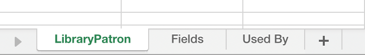

# 自定义对象元数据导出{#custom-object-metadata-export}

如果您使用我们的SOAP API或Munchkin API，则可以导出自定义对象元数据模式。 下面介绍如何获得它。

1. 在“我的营销人员”中，单击&#x200B;**管理员**。

   

1. 单击&#x200B;**Marketo Custom Objects**。

   

1. 选择要导出的Marketo自定义对象。

   

1. 单击&#x200B;**自定义对象操作**&#x200B;下拉框并选择&#x200B;**导出对象**。

   

>[!NOTE]
>
>要导出自定义对象，必须处于“已批准”状态。

现在，您有一个电子表格，其模式为“自定义对象”，位于三个选项卡之间。

