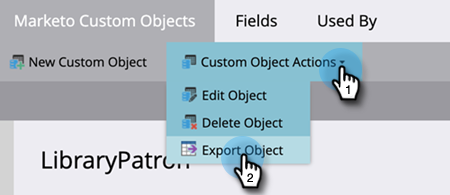

# 自定义对象元数据导出 {#custom-object-metadata-export}

如果您使用我们的SOAP API或[!DNL Munchkin] API，则可以导出自定义对象元数据架构。 下面是如何获取它。

>[!AVAILABILITY]
>
>并非所有Marketo Engage用户都已购买此功能。 有关详细信息，请联系Adobe客户团队（您的客户经理）。

1. 转到&#x200B;**[!UICONTROL Admin]**&#x200B;区域。

   

1. 单击 **[!UICONTROL Marketo Custom Objects]**。

   

1. 选择要导出的Marketo自定义对象。

   

1. 单击&#x200B;**[!UICONTROL Custom Object Actions]**&#x200B;下拉菜单并选择&#x200B;**[!UICONTROL Export Object]**。

   

>[!NOTE]
>
>自定义对象必须处于已批准状态才能导出。

现在，您有一个包含自定义对象架构的电子表格，可跨三个选项卡。

