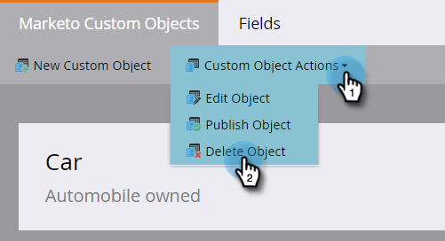

# 编辑和删除Marketo自定义对象{#edit-and-delete-a-marketo-custom-object}

>[!NOTE]
>
>在批准自定义对象后，您便无法创建、编辑或删除链接或重复数据消除字段。

## 编辑自定义对象{#edit-a-custom-object}

使用“自定义对象操作”菜单可编辑或删除自定义对象。

1. 单击&#x200B;**Admin**，在&#x200B;**Database Management**&#x200B;中，选择&#x200B;**Marketo Custom Objects**。

   

1. 选择要在右侧编辑的自定义对象。

   

1. 单击&#x200B;**自定义对象操作**&#x200B;选项卡，然后单击&#x200B;**编辑对象**。

   

   >[!NOTE]
   >
   >“编辑对象”显示的字段与“创建对象”相同，但API名称无法编辑除外。

1. 进行任何更改。 如果要在“潜在客户详细信息”页面上显示对象，请将滑块拖动到上方。 单击&#x200B;**保存**。

   

1. 请务必批准[已编辑对象](/help/marketo/product-docs/administration/marketo-custom-objects/approve-a-custom-object.md)。

## 删除自定义对象{#delete-a-custom-object}

删除自定义对象很容易，但您需要小心。 自定义对象可以连接到其他对象或智能列表。 因此，Marketo会在允许您单击&#x200B;**删除**&#x200B;之前向您发出警告。

>[!CAUTION]
>
>删除自定义对象后，无法恢复它。

1. 单击&#x200B;**Admin**，在&#x200B;**Database Management**&#x200B;中，选择&#x200B;**Marketo Custom Objects**。

   

1. 选择要删除的对象。

   

1. 单击&#x200B;**自定义对象操作**&#x200B;并选择&#x200B;**删除对象**。

   

   >[!TIP]
   >
   >也可以右键单击该对象，然后选择&#x200B;**删除对象**。

1. 如果自定义对象为草稿形式，但尚未批准，您将收到此警告。 如果确定，请单击&#x200B;**删除**。

   

1. 如果已批准自定义对象，则删除该对象时风险更大。 你会得到这个严重警告。 输入&#x200B;**我了解**，选中&#x200B;**无法撤消**&#x200B;复选框，然后单击&#x200B;**删除**。

   

   >[!NOTE]
   >
   >如果自定义对象链接到中间对象，则必须先删除中间对象。

>[!MORELIKETHIS]
>
>[批准自定义对象](/help/marketo/product-docs/administration/marketo-custom-objects/approve-a-custom-object.md)
