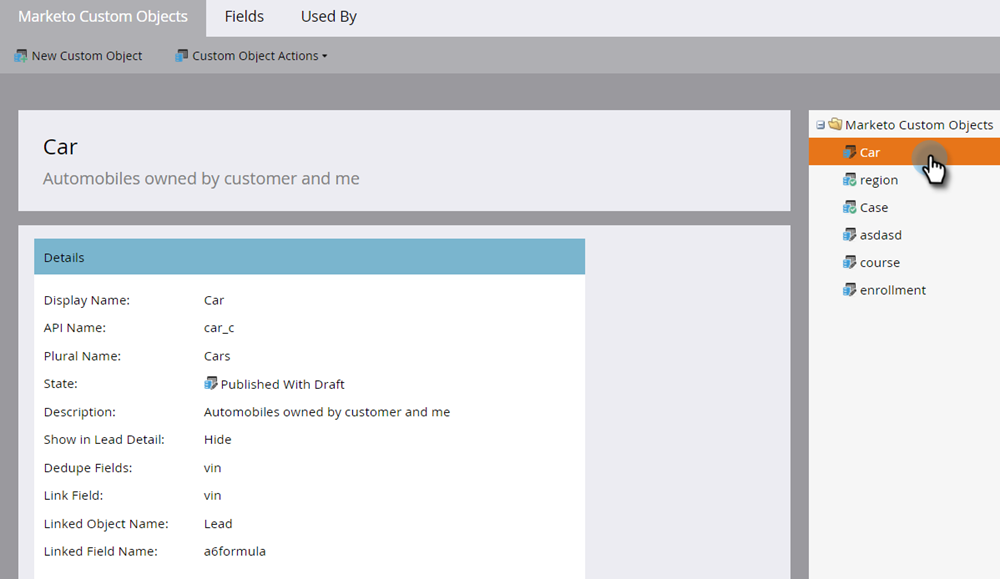

# 编辑和删除Marketo自定义对象 {#edit-and-delete-a-marketo-custom-object}

>[!NOTE]
>
>批准自定义对象后，便无法创建、编辑或删除链接或重复数据删除字段。

## 编辑自定义对象 {#edit-a-custom-object}

使用“自定义对象操作”菜单可编辑或删除自定义对象。

1. 转到 **管理员** 的上界。

   

1. 单击 **Marketo自定义对象**.

   

1. 选择要在右侧编辑的自定义对象。

   

1. 单击 **自定义对象操作** 选项卡，单击 **编辑对象**.

   

1. 进行所需的更改。 如果要在“潜在客户详细信息”页面上显示对象，请将滑块拖动到上面。 单击 **保存**.

   

1. 请务必批准 [编辑的对象](/help/marketo/product-docs/administration/marketo-custom-objects/approve-a-custom-object.md).

## 删除自定义对象 {#delete-a-custom-object}

删除自定义对象很容易，但您需要小心。 自定义对象可以连接到其他对象或智能列表。 所以，Marketo在让你点击 **删除**.

>[!CAUTION]
>
>删除自定义对象后，无法恢复该对象。

1. 转到 **管理员** 的上界。

   

1. 单击 **Marketo自定义对象**.

   

1. 选择要删除的对象。

   

1. 单击 **自定义对象操作** 选择 **删除对象**.

   

   >[!TIP]
   >
   >您还可以右键单击对象并选择 **删除对象**.

1. 如果自定义对象为草稿形式，但尚未批准，您将收到此警告。 如果确定，请单击 **删除**.

   

1. 如果自定义对象已获得批准，则删除该对象时风险更大。 你会得到这严重警告的。 输入 **我明白**，请查看 **无法撤消** 复选框，然后单击 **删除**.

   

   >[!NOTE]
   >
   >如果自定义对象已链接到中间对象，则必须先删除中间对象。

>[!MORELIKETHIS]
>
>[批准自定义对象](/help/marketo/product-docs/administration/marketo-custom-objects/approve-a-custom-object.md)
