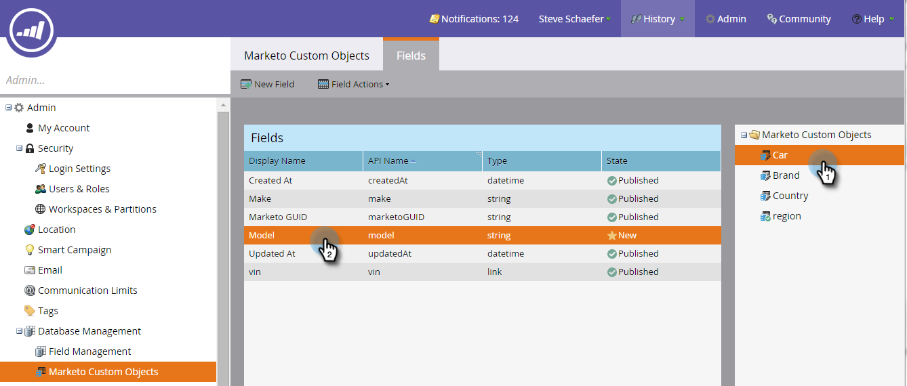

# 编辑和删除Marketo自定义对象字段 {#edit-and-delete-marketo-custom-object-fields}

## 编辑字段 {#edit-a-field}

有时，您需要编辑尚未批准的字段。

1. 单击自定义对象和要编辑的字段。

   

1. 在字段选项卡上，单击 **字段操作** 和 **编辑字段**.

   

1. 进行更改并单击 **保存**.

   

   >[!NOTE]
   >
   >您无法编辑API名称。

1. 这些更改将显示在字段列表中。

   

## 删除字段 {#delete-a-field}

当您不再需要自定义对象中的字段时，可以删除该字段。

1. 在字段选项卡上，单击 **字段操作** 和 **删除字段**.

   

   在触发器之前，请确保确实要删除该字段！ 单击 **删除**.

   

   它不见了！

   

   >[!NOTE]
   >
   >[添加Marketo自定义对象字段](/help/marketo/product-docs/administration/marketo-custom-objects/add-marketo-custom-object-fields.md)
