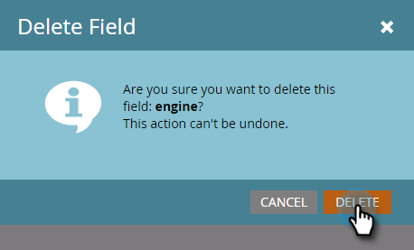

# 编辑和删除 Marketo 自定义对象字段 {#edit-and-delete-marketo-custom-object-fields}

## 编辑字段 {#edit-a-field}

有时您需要编辑尚未批准的字段。

1. 单击自定义对象和要编辑的字段。

   

1. 在[!UICONTROL Fields]选项卡中，单击&#x200B;**[!UICONTROL Field Actions]**&#x200B;和&#x200B;**[!UICONTROL Edit Field]**。

   

1. 进行更改并单击&#x200B;**[!UICONTROL Save]**。

   

   >[!NOTE]
   >
   >无法编辑API名称。

1. 更改显示在&#x200B;**[!UICONTROL Fields]**&#x200B;列表中。

   

## 删除字段 {#delete-a-field}

当不再需要自定义对象中的字段时，您可以将其删除。

1. 在字段选项卡中，单击&#x200B;**[!UICONTROL Field Actions]**&#x200B;和&#x200B;**[!UICONTROL Delete Field]**。

   

1. 确认要删除该字段后再继续。 单击 **[!UICONTROL Delete]**。

   

该字段即被删除。

>[!NOTE]
>
>[添加Marketo自定义对象字段](/help/marketo/product-docs/administration/marketo-custom-objects/add-marketo-custom-object-fields.md)
