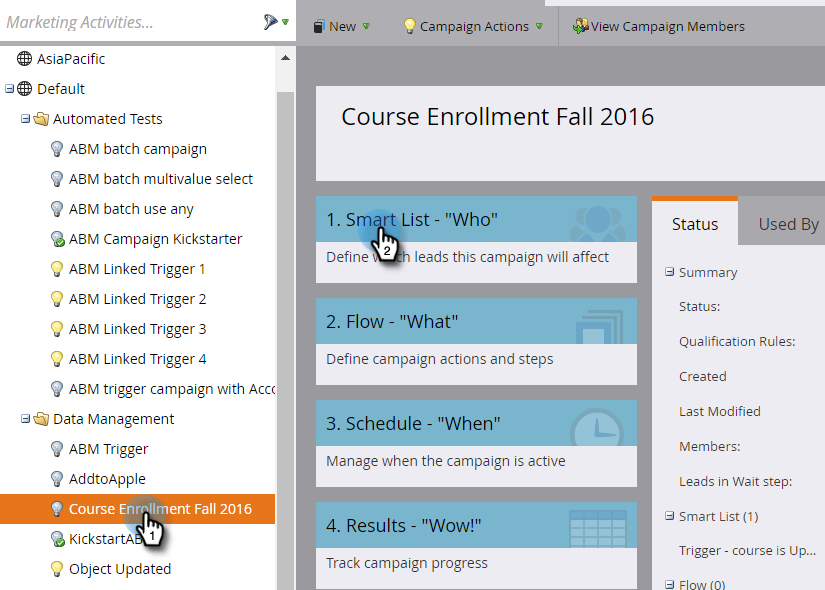

# 触发自定义对象更改 {#trigger-off-custom-object-changes}

>[!NOTE]
>
>此功能仅可用：
>
>* 对于Orion基础架构上的客户
>* 仅用于Marketo自定义对象，而不是通过本机Salesforce或Microsoft Dynamics集成同步的自定义对象
>* 作为触发器，而不是过滤器
>
>请联系 [Marketo支持](https://nation.marketo.com/t5/Support/ct-p/Support) 启用自定义对象更改触发器。

在智能营销活动的智能列表中，当将自定义对象添加到人员或公司时，您可以触发流量操作。 您还可以创建一个智能列表，该列表使用 *更改* 作为触发器的自定义对象中。 例如，当课程名称更新时，使用它发送电子邮件。

>[!NOTE]
>
>更改自定义对象记录时，不会创建活动日志条目。

1. 在Marketo，转到 **营销活动。**

   

1. 创建或打开现有的智能营销活动，然后选择智能列表。

   

1. 搜索所需的触发器，并将其拖动到画布上。

   

1. 选择触发器属性。

   

1. （可选）设置约束。

   

1. 你在这。 更改将自动保存。

   

   >[!NOTE]
   >
   >* [创建智能列表](/help/marketo/product-docs/core-marketo-concepts/smart-lists-and-static-lists/creating-a-smart-list/create-a-smart-list.md)
   >* [了解Marketo自定义对象](/help/marketo/product-docs/administration/marketo-custom-objects/understanding-marketo-custom-objects.md)

