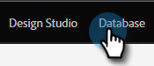

# 了解Marketo自定义对象 {#understanding-marketo-custom-objects}

使用自定义对象跟踪特定于您的业务的量度。

>[!AVAILABILITY]
>
>并非所有客户都已购买此功能。 有关详细信息，请与您的销售代表联系。

在智能营销活动中将自定义对象用作过滤器和触发器。 例如：

* **筛选**：仅向特定车辆品牌的所有者发送电子邮件
* **触发器**：将自定义对象添加到人员或公司时发送电子邮件。

您可以在一对多或多对多关系中设置自定义对象。 例如：

* **一对多**：一人拥有多辆汽车
* **多对多**：多个学生从课程目录注册了多个课程

一对多结构使用单个链接字段将自定义对象连接到人员或公司。

多对多的自定义对象使用两个链接字段，这些字段是中间对象的一部分。 一个“链接”字段连接到人员或公司，另一个字段连接到自定义对象，如课程目录。 此中间对象可以包含其他自定义字段，如课程等级或出勤日期，这些字段进一步定义了连接的性质。

>[!TIP]
>
>在用户界面中使用逗号分隔值(CSV)导入自定义对象，以测试和验证数据示例。 然后，使用API上传所有文件。

>[!CAUTION]
>
>您无法恢复自定义对象，因此在删除它们之前请确保不再需要它们。

## 访问Marketo自定义对象 {#accessing-marketo-custom-objects}

1. 转到 **[!UICONTROL 管理员]** 区域。

   

1. 单击 **[!UICONTROL Marketo自定义对象]**.

   

1. Marketo自定义对象显示将在右侧列出您的所有自定义对象，但只列出主网格中批准的自定义对象。

   

   >[!NOTE]
   >
   >网格显示对象名称、记录数、字段数和最近更新的日期。

   >[!TIP]
   >
   >Marketo会自动更新这些字段，但您可以通过单击记录列中的图标来刷新显示。

1. 单击右侧的对象名称以打开详细信息页面。

   

## 查看与人员关联的自定义对象 {#view-custom-objects-associated-to-a-person}

创建自定义对象结构后，当您上载特定的自定义对象数据时，自定义对象会自动使用自定义对象中的链接字段与数据库中的人员关联。 您可以从以下位置查看信息： [!UICONTROL 自定义对象] 选项卡。

1. 转到 **[!UICONTROL 数据库]**.

   

1. 打开数据库，然后单击 **[!UICONTROL 人员]** 选项卡。 双击与自定义对象关联的人员的记录。

   

1. 在人员详细信息页面上，单击 **[!UICONTROL 自定义对象]** 选项卡。 从下拉列表中选择对象。

   

1. 现在，您可以查看与该人员关联的所有该类型自定义对象的列表。

   

## 在公司中使用自定义对象 {#using-custom-objects-with-companies}

如果从CRM同步公司，或者使用API明确创建公司，则链接到公司的自定义对象将发挥最佳效果。 我们还建议您使用公司ID作为链接字段。

如果您在Marketo中有多个人员属于CRM或仅限Marketo的记录中，则链接到公司的自定义对象将不会与多个单个记录关联。 这是因为只有从CRM同步公司或您使用API明确创建公司时，才支持其下有多个人员的公司。

自定义对象只能直接链接到单个记录。 这意味着，当您的自定义对象类型由公司字段链接时，如果您使用Marketo的REST API管理公司，则应确保通过CRM中的联系人转换或使用externalCompanyId字段将人员记录与公司关联。 对于未明确链接到公司记录的人员记录，即使公司字段的值在多个人员之间共享，使用公司链接的自定义对象也将随机链接到单个记录。

请参阅 [导入自定义对象数据](/help/marketo/product-docs/administration/marketo-custom-objects/import-custom-object-data.md) 以了解更多信息。

>[!MORELIKETHIS]
>
>* [创建Marketo自定义对象](/help/marketo/product-docs/administration/marketo-custom-objects/create-marketo-custom-objects.md)
>* [批准自定义对象](/help/marketo/product-docs/administration/marketo-custom-objects/approve-a-custom-object.md)
>* [编辑和删除Marketo自定义对象](/help/marketo/product-docs/administration/marketo-custom-objects/edit-and-delete-a-marketo-custom-object.md)
>* [添加Marketo自定义对象字段](/help/marketo/product-docs/administration/marketo-custom-objects/add-marketo-custom-object-fields.md)
>* [编辑和删除Marketo自定义对象字段](/help/marketo/product-docs/administration/marketo-custom-objects/edit-and-delete-marketo-custom-object-fields.md)
>* [导入自定义对象数据](/help/marketo/product-docs/administration/marketo-custom-objects/import-custom-object-data.md)
