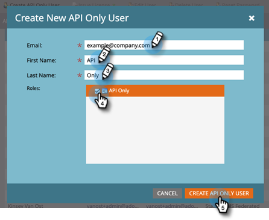

# 为启用了Adobe IMS的订阅添加仅API用户 {#add-api-only-user-for-adobe-ims-enabled-subscriptions}

虽然Marketo Engage营销用户和管理员在Adobe Admin Console中进行管理，但必须在Marketo Engage中创建和管理仅Marketo EngageAPI用户。

以下步骤描述如何在Marketo Engage中添加仅限API用户。 在执行此操作之前，您必须 [已建立仅API角色](/help/marketo/product-docs/administration/users-and-roles/create-an-api-only-user-role.md).

1. 在Marketo中，单击 **管理员** 选择 **用户和角色**.

   

1. 单击 **仅创建API用户**.

   

1. 为仅API用户输入电子邮件、名字和姓氏。  选择要分配给用户的API仅角色。 单击 **仅创建API用户** 完成时。

   

>[!NOTE]
>
>操作成功后，仅创建API用户模式将关闭，用户列表将刷新，新用户将可见。
