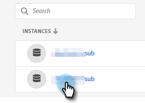

# 添加或删除用户 {#add-or-remove-a-user}

## 添加用户 {#add-a-user}

1. 登录到 [Adobe Admin Console](https://adminconsole.adobe.com/).

   

1. 单击 **Marketo Engage**.

   

1. 选择所需的订阅（如果您有多个订阅）。

   

1. 单击 **用户** 选项卡。

   

1. 单击 **添加用户** 按钮。

   

1. 输入要添加的用户的名称、用户组或电子邮件地址。 名字和姓氏是可选的。

   

1. 单击 **+** 图标，然后选择所需的产品配置文件。

   

   >[!IMPORTANT]
   >
   >用户 **必须** 添加到产品配置文件，以访问Marketo Engage。

1. 单击 **保存**.

   

随后，用户将收到一封用于登录到Marketo Engage的电子邮件。

>[!NOTE]
>
>通过Adobe Admin Console将用户添加到Marketo Engage后，会在订阅的默认工作区中向他们授予“标准用户”角色。 如果需要调整用户在工作区中的角色，则可在Marketo Engage中完成， [如下所述](/help/marketo/product-docs/administration/users-and-roles/managing-user-roles-and-permissions.md).

## 删除用户 {#remove-a-user}

1. 登录到 [Adobe Admin Console](https://adminconsole.adobe.com/).

   

1. 单击 **Marketo Engage**.

   

1. 选择所需的订阅（如果您有多个订阅）。

   

1. 单击 **用户** 选项卡。

   

1. 选择要删除的用户，然后单击 **删除** 按钮。

   

1. 单击 **删除用户** 确认。

   

随后，用户将收到一封电子邮件，通知他们不再具有Marketo Engage权限。

>[!MORELIKETHIS]
>
>* [Adobe Admin Console用户](https://helpx.adobe.com/enterprise/using/users.html)
>* [单独管理用户](https://helpx.adobe.com/enterprise/using/manage-users-individually.html)

