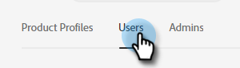

# 添加或移除用户 {#add-or-remove-a-user}

## 添加用户 {#add-a-user}

1. 登录到[Adobe Admin Console](https://adminconsole.adobe.com/){target="_blank"}。

   

1. 单击&#x200B;**Marketo Engage**。

   

1. 选择所需的订阅（如果您有多个订阅）。

   

1. 单击&#x200B;**[!UICONTROL Users]**&#x200B;选项卡。

   

1. 单击&#x200B;**[!UICONTROL Add User]**&#x200B;按钮。

   

1. 输入要添加的用户的名称、用户组或电子邮件地址。 名字和姓氏是可选的。

   

1. 单击&#x200B;**+**&#x200B;图标并选择所需的产品配置文件。

   

   >[!IMPORTANT]
   >
   >必须将用户&#x200B;_添加到产品配置文件中才能访问Marketo Engage。_

1. 单击 **[!UICONTROL Save]**。

   

随后，用户将收到一封用于登录Marketo Engage的电子邮件。

>[!NOTE]
>
>当用户通过Adobe Admin Console添加到Marketo Engage时，将会在订阅的默认工作区中向他们授予“标准用户”角色。 如果需要调整用户在工作区中的角色，请在Marketo Engage [中调整该角色，如此处](/help/marketo/product-docs/administration/users-and-roles/managing-user-roles-and-permissions.md){target="_blank"}所述。

## 删除用户 {#remove-a-user}

>[!NOTE]
>
>您必须是系统管理员才能删除用户。

1. 登录到[Adobe Admin Console](https://adminconsole.adobe.com/){target="_blank"}。

   

1. 单击&#x200B;**Marketo Engage**。

   

1. 选择所需的订阅（如果您有多个订阅）。

   

1. 单击&#x200B;**[!UICONTROL Users]**&#x200B;选项卡。

   

1. 选择要删除的用户并单击&#x200B;**[!UICONTROL Remove]**&#x200B;按钮。

   

1. 单击&#x200B;**[!UICONTROL Remove User]**&#x200B;确认。

   

然后，用户将收到一封电子邮件，通知他们不再具有对Marketo Engage的访问权限。

>[!MORELIKETHIS]
>
>* [Adobe Admin Console用户](https://helpx.adobe.com/cn/enterprise/using/users.html){target="_blank"}
>* [单独管理用户](https://helpx.adobe.com/cn/enterprise/using/manage-users-individually.html){target="_blank"}
