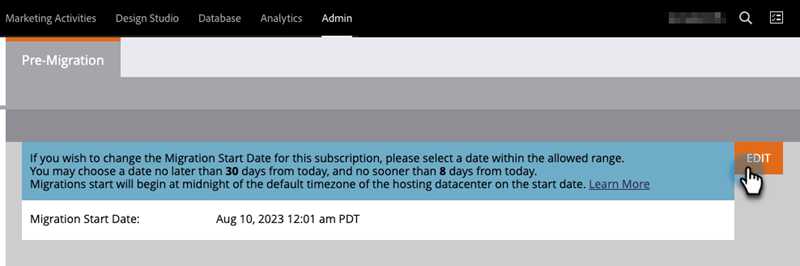

# 迁移到Adobe Identity {#migrating-to-adobe-identity}

当Adobe计划订阅的用户迁移时，Marketo Engage产品管理员将获得对迁移控制台的访问权限，该权限可在集成下管理区域的导航菜单中找到。

## 预迁移 {#pre-migration}

在迁移开始之前，管理员可以通过导航到迁移控制台中的预迁移屏幕来修改其订阅的用户迁移开始日期。 若要更改日期，管理员可以单击&#x200B;**编辑**&#x200B;按钮。

管理员可以选择将来8到30天的日期。 选择日期后，管理员必须单击&#x200B;**保存**&#x200B;以进行更改。

>[!NOTE]
>
>若要请求在8天之前或超过30天的日期，或者如果您需要在迁移前控制台锁定之后调整日期，请向`marketocares@marketo.com`发送电子邮件。

## 迁移到Adobe Identity {#migrations-to-adobe-identity}

以美国时区为时区的所有Marketo订阅都将从用户迁移开始日期的太平洋标准时间午夜开始迁移。 所有其他订阅的用户迁移将在订阅指定时区的午夜开始。 当订阅的用户迁移开始时，用户管理在Marketo管理区域中不再可用，仅在Adobe Admin Console中可用。 角色管理仍保留在“Marketo管理”区域的“用户和角色”选项卡中，以及本地（仅限API）用户管理中。

Adobe将首先使用已验证的电子邮件自动迁移所有Marketo管理员（具有标准管理员角色）。 将Marketo管理员迁移到Adobe Identity后，他们将会作为Marketo订阅的产品管理员添加到订阅的Adobe Admin Console中，并将在Marketo应用程序中分配Adobe产品管理员角色（以及他们以前具有的任何其他角色），并且其Adobe ID将有权使用该订阅。 管理员将收到两封电子邮件。 一个指示作为Admin Console产品管理员分配，另一个指示其Adobe ID有权使用Marketo产品。

>[!IMPORTANT]
>
>您必须单击授权电子邮件中的&#x200B;**接受邀请**&#x200B;按钮，才能使用Adobe ID访问Marketo Engage。

**Marketo产品管理员电子邮件**

**Marketo权利电子邮件**

**如果您的Marketo订阅在Marketo和/或Adobe组织**&#x200B;中没有SSO，Adobe将自动迁移其余用户。 此工作流旨在实现最高级别的自动化，无需执行任何操作即可执行迁移。 迁移完成后，Marketo迁移控制台将不再显示在Marketo管理导航区域中，所有用户都将使用Adobe ID访问Marketo。

**如果您的Marketo订阅在Marketo和/或Adobe组织**&#x200B;中具有SSO，Marketo管理员将在用户迁移开始后访问迁移控制台的自助用户迁移工具，并在登录“我的Marketo”页面时通过横幅发送警报。 管理员将负责使用自助用户迁移工具完成用户迁移。

## Marketo自助用户迁移 {#marketo-self-service-user-migration}

Marketo自助用户迁移控制台工具包含两个选项卡。

* **“迁移状态”选项卡**
* **用户迁移选项卡**

完成自助服务迁移需要3个主要步骤。

1. 迁移所有符合条件的电子邮件地址验证用户（“用户迁移”选项卡）
1. 跳过所有不符合条件的用户和任何不符合条件的用户（“用户迁移”选项卡）
1. 完成步骤1和2后，完成迁移确认（“迁移状态”选项卡）

### “迁移状态”选项卡 {#migration-status-tab}

“迁移状态”选项卡提供有关用户电子邮件验证先决条件、用户迁移和激活以及完成订阅迁移的进度的整体量度。

在迁移状态的顶部，将显示订阅迁移到期和延长到期时间的按钮。 有关迁移到期的详细信息，请参阅[用户迁移到期部分](#user-migration-expiration)。

在迁移状态选项卡的下一部分，有两个进度条。 第一个进度条是显示用户电子邮件验证完成的进度。 第二个进度条显示用户迁移完成的进度。

接下来，向管理员显示“状态”的三个部分。

* **用户电子邮件验证**：订阅中用户的验证状态。
* **用户迁移和激活**：订阅中用户的用户迁移和激活(迁移和授予Marketo Engage产品的权限)状态。
* **迁移确认**：订阅的迁移完成状态。

#### 用户电子邮件验证 {#user-email-verification}

在用户电子邮件验证部分，管理员可以在迁移到Adobe Identity之前找到订阅中用户的电子邮件验证的当前状态。

管理员可以查看订阅的电子邮件验证状态、订阅中已完成电子邮件验证的用户百分比，以及标记为跳过的用户的数量。 将报告订阅中所有用户的电子邮件验证状态的状态。 管理员可以单击跳过的用户的数量，并将导航到“用户迁移”选项卡以查看跳过的用户。

验证电子邮件可由管理员在迁移控制台的用户迁移选项卡和Marketo管理区域的用户和角色选项卡中重新发送，或由用户在其帐户设置中重新发送。 与用户邀请电子邮件类似，验证电子邮件中的链接将在3天后过期。 有关电子邮件验证的更多信息，请参阅[社区](https://nation.marketo.com/)和[电子邮件验证文档](/help/marketo/product-docs/administration/users-and-roles/email-verification.md)。

>[!IMPORTANT]
>
>如果Marketo Engage用户不验证其电子邮件地址，则无法将其迁移到Adobe ID，并且在迁移完成后，他们将失去对Marketo订阅的访问权限。 要重新获得访问权限，Marketo产品管理员需要将用户添加为新用户。

#### 用户迁移和激活 {#user-migration-and-activation}

在“用户迁移和激活”部分，管理员可以找到总用户迁移和Adobe Identity Management系统权利的当前状态。

管理员可以查看其订阅中已迁移到Adobe ID或标记为已跳过的用户的百分比。 所有用户迁移到订阅中Adobe ID的状态都将报告状态，或标记为已跳过，将不迁移。 当用户已迁移并有权使用Marketo Engage或被跳过时，此状态将会更新。

#### 迁移确认 {#migration-confirmation}

在“迁移确认”部分中，需要管理员确认订阅的用户迁移已完成。

计入订阅中的所有用户（已迁移或已跳过）后，将显示“完成迁移”按钮。

执行迁移的管理员需要通过单击&#x200B;**完成迁移**&#x200B;按钮完成迁移确认。 系统将提示他们&#x200B;**确认**。

确认用户迁移完成后，将从管理员导航菜单中移除迁移控制台。

### 用户迁移过期 {#user-migration-expiration}

Adobe要求客户在30天内完成自助迁移。 如果过期日期，则不会阻止管理员迁移用户或完成迁移，但是，管理员只能按需迁移用户。 如果管理员需要更多时间，他们可以延长订阅的过期日期。

单击&#x200B;**延长到期时间**&#x200B;按钮后，日期将更新为一周后。 管理员可将过期时间延长多达三次。

如果您未在到期日之前完成迁移，Adobe将会与您联系。

### “用户迁移”选项卡 {#user-migration-tab}

“用户迁移”选项卡为管理员提供了完全控制用户迁移的工具。

管理员可以选择执行以下操作：

* 通过“验证电子邮件”按钮触发未验证用户的验证电子邮件
* 对于管理员知道可以/不会验证其电子邮件或不应该通过“跳过迁移”按钮迁移的用户，跳过用户迁移
* 通过“立即迁移”按钮按需迁移选定的用户
* 通过“计划迁移”按钮，为选定用户在特定日期安排用户迁移
* 通过“迁移所有用户”按钮根据需要迁移所有符合条件的用户（无需用户选择）

**验证电子邮件**

需要将用户迁移到Adobe ID的电子邮件验证是必需的。 如果有任何用户尚未验证其电子邮件地址并需要迁移，则管理员可以触发验证电子邮件，再次发送给该用户。 选择未验证的用户后，“验证电子邮件”按钮将变为可单击状态。

当管理员单击&#x200B;**验证电子邮件**&#x200B;按钮时，他们将收到发送电子邮件的通知。

**跳过和取消跳过用户迁移**

在用户迁移期间，需要迁移或跳过所有用户。 Adobe要求管理员确认不会迁移用户，并且管理员需要将用户标记为已跳过。 如果管理员未确认，他们将无法确认用户迁移已完成。 一旦用户迁移完成，所有跳过的用户都将失去对Marketo的访问权限。

>[!IMPORTANT]
>
>管理员必须跳过包含未验证电子邮件的所有用户。 如果存在已验证其电子邮件的用户，但管理员出于任何原因不希望迁移这些用户，则应将他们标记为已跳过。

要跳过某个用户，管理员可以选择所需的用户。 单击“跳过迁移”按钮。 单击&#x200B;**跳过迁移**&#x200B;按钮后，页面将刷新，所选用户的验证状态和迁移状态将更新为“已跳过”。

如果确定需要迁移某个用户，管理员可以取消跳过先前跳过的用户。

要取消跳过某个用户，管理员可以选择所需的用户。 单击“未跳过迁移”按钮。 单击&#x200B;**取消跳过迁移**&#x200B;按钮后，页面将刷新。  选定用户的验证状态将更新为其当前状态（“已验证”或“未验证”），并且用户的迁移状态将更新为“未启动”。

>[!NOTE]
>
>只有所有选定用户都具有“已跳过”迁移状态时，“未跳过迁移”按钮才会处于活动状态。

### 将Marketo用户迁移到Adobe ID {#migrating-marketo-users-to-adobe-ids}

Marketo产品管理员将能够选择要批量迁移的用户，或者一次性选择所有符合条件的用户。 选择用户后，管理员可以选择“立即迁移”或“计划迁移”以供日后使用，从而让管理员能够灵活控制迁移的用户以及迁移时间。 在订阅中，管理员还可以选择“迁移所有用户”。

例如，管理员可以选择要首先迁移的一组“超级用户”。 成功完成这些用户迁移后，他们可以根据变量（如工作区/业务或功能/角色）选择不同的用户组，以进一步按批次进行用户迁移。 或者，他们可以决定在第一个批次成功后迁移订阅中的其余用户。 我们的目标是尽可能灵活地将Adobe ID转出给用户。

所有用户迁移同时发生，并且应在六十秒内成功完成。 当针对特定用户进行用户迁移时，用户最多可能失去1分钟的访问权限，仅当用户登录应用程序时才会发生这种情况。 用户迁移完成后，用户将收到一封电子邮件，介绍如何使用Adobe身份登录Marketo Engage。 用户需要通过电子邮件&#x200B;_中的按钮链接接受邀请，然后才能使用Adobe ID登录_。 有关如何使用Adobe ID [登录Marketo Engage的说明，请参阅此处](/help/marketo/product-docs/administration/marketo-with-adobe-identity/user-sign-in-with-adobe-id.md)。

用户迁移是独立处理的，因此，如果用户迁移失败，Adobe将继续处理其他用户迁移。 如果发生用户迁移失败，则管理员无需执行任何操作。 管理员将收到一封关于该错误的电子邮件通知，并提醒Adobe正在努力立即解决问题。 如果用户迁移失败且已登录到Marketo Engage，则在迁移重试期间，用户最多可能会丢失两分钟的访问权限。 如果用户迁移失败，则用户可以继续使用其Marketo身份访问Marketo Engage，直到收到电子邮件通知表明其迁移成功，并且他们被邀请使用Adobe ID登录。

**立即迁移**

管理员可以选择一个或多个要按需迁移的用户。 这将立即触发用户迁移。 要迁移一个或多个用户，管理员可以选择所需的用户，并且“立即迁移”按钮将变为可单击。

>[!NOTE]
>
>只有所有选定用户都具有“已验证”验证状态时，“立即迁移”按钮才会处于活动状态。

单击&#x200B;**立即迁移**&#x200B;按钮后，将提示管理员确认所选用户的迁移。 管理员确认后，将尽快开始处理用户迁移。

**计划迁移**

管理员可以选择一个或多个用户来安排以后进行迁移。 要计划一个或多个用户的迁移，管理员会选择所需用户，并且“计划迁移”按钮将变为可单击。

>[!NOTE]
>
>只有所有用户的验证状态为“已验证”，迁移状态为“未启动”或“Adobe ID已创建”时，“计划迁移”按钮才会处于活动状态。

单击&#x200B;**计划迁移**&#x200B;按钮后，将提示管理员选择所选用户的所需迁移日期。 管理员只能选择订阅的迁移到期日期之前的日期。 管理员确认后，用户迁移将安排在选定的日期开始处理。

>[!NOTE]
>
>以美国时区为时区的所有Marketo订阅都将从迁移开始日期的太平洋标准时间午夜开始迁移。 所有其他订阅的用户迁移将在订阅指定时区的午夜开始。

**迁移所有用户**

管理员可以随时选择迁移订阅中所有符合条件的用户。 这将立即触发符合条件的用户的迁移。 符合条件的用户是拥有经验证的电子邮件的用户，这些用户尚未迁移。

单击“迁移所有用户”****&#x200B;按钮后，将提示管理员&#x200B;**确认所有符合条件的用户的**&#x200B;迁移。 管理员确认后，将尽快开始处理用户迁移。

