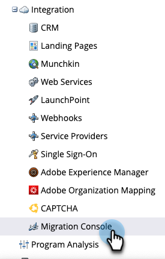
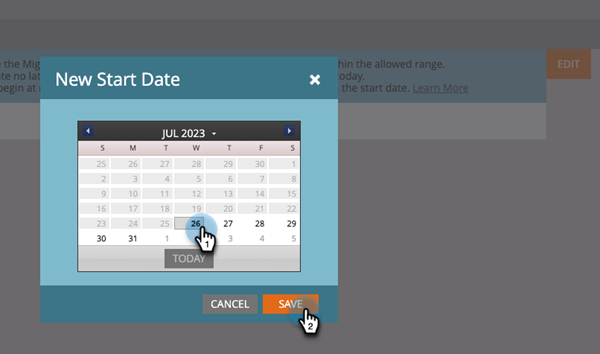
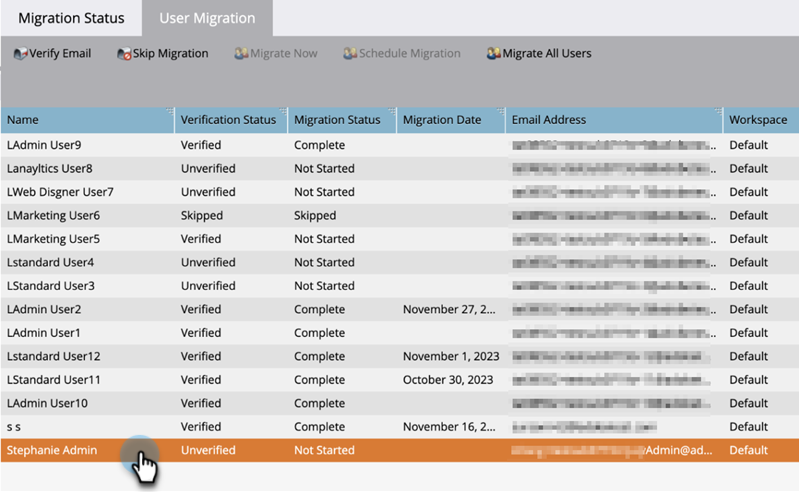

# 迁移至 Adobe Identity {#migrating-to-adobe-identity}

当 Adobe 为某个订阅安排用户迁移时，Marketo Engage 的产品管理员将获得对“迁移控制台”的访问权限，该控制台位于“管理员”区域中“集成”下的导航菜单内。

## 迁移前 {#pre-migration}

在迁移开始之前，管理员可以通过进入迁移控制台中的“迁移前”页面，修改其订阅的用户迁移开始日期。要更改日期，管理员可以点击&#x200B;**编辑**&#x200B;按钮。

管理员可以选择未来 8 到 30 天内的任一日期。选择日期后，管理员必须点击&#x200B;**保存**&#x200B;才能使更改生效。

>[!NOTE]
>
>如果需要将日期设置为少于 8 天或超过 30 天，或在迁移前控制台锁定后仍需调整日期，请发送电子邮件至 `marketocares@marketo.com`。

## 迁移到 Adobe Identity {#migrations-to-adobe-identity}

所有使用美国时区的 Marketo 订阅，将在用户迁移开始日期当天的太平洋标准时间午夜开始迁移。所有其他订阅的用户迁移，将在其订阅所指定时区的午夜开始。当某个订阅的用户迁移开始后，将无法再在 Marketo 的“管理员”区域中进行用户管理，用户管理将只能通过 Adobe Admin Console 完成。角色管理仍保留在 Marketo “管理员”区域的“用户和角色”选项卡中，同时本地（仅 API）用户管理也将继续保留。

Adobe 将首先自动迁移所有已验证电子邮件地址的 Marketo 管理员（具有标准管理员角色）。当 Marketo 管理员迁移到 Adobe Identity 后，会将他们添加到该订阅的 Adobe Admin Console 中，作为 Marketo 订阅的产品管理员，并在 Marketo 应用出现中分配获得 Adobe 产品管理员角色（同时保留其之前拥有的其他角色），其 Adobe ID 也将获得该订阅的使用权限。管理员将收到两封电子邮件。其中一封用于通知已将其分配为 Admin Console 的产品管理员，另一封用于通知其 Adobe ID 已获得 Marketo 产品的使用权限。

>[!IMPORTANT]
>
>您必须点击授权电子邮件中的&#x200B;**接受邀请**&#x200B;按钮，才能使用 Adobe ID 访问 Marketo Engage。

**Marketo 产品管理员电子邮件**

**Marketo 授权电子邮件**

**如果您的 Marketo 订阅在 Marketo 和/或 Adobe 组织中未启用 SSO**，Adobe 将自动迁移其余所有用户。该流程旨在实现最高程度的自动化，无需您采取任何操作即可完成迁移。迁移完成后，Marketo 迁移控制台将不再显示在 Marketo 管理员导航中，所有用户都将使用 Adobe ID 访问 Marketo。

**如果您的 Marketo 订阅在 Marketo 和/或 Adobe 组织中启用了 SSO**，则在用户迁移开始后，Marketo 管理员将获得迁移控制台中的“自助用户迁移”工具访问权限，并在登录 My Marketo 页面时通过横幅提示收到通知。管理员将负责使用自助用户迁移工具完成用户迁移。

## Marketo 自助用户迁移 {#marketo-self-service-user-migration}

Marketo 自助用户迁移控制台工具包含两个选项卡。

* **迁移状态选项卡**
* **用户迁移选项卡**

完成自助迁移需要执行以下 3 个主要步骤。

1. 迁移所有需要迁移且已完成电子邮件验证的合格用户（用户迁移选项卡）
1. 跳过所有不符合条件的用户，以及任何不希望迁移的合格用户（用户迁移选项卡）
1. 完成步骤 1 和 2 后，在迁移状态选项卡中完成迁移确认

### 迁移状态选项卡 {#migration-status-tab}

“迁移状态”选项卡提供有关用户电子邮件验证前置条件、用户迁移与激活进度，以及订阅迁移完成情况的整体量度。

在迁移状态页面顶部，会显示订阅迁移的有效期限，以及用于延长过期时间的按钮。有关迁移有效期限的更多信息，请参阅[用户迁移过期](#user-migration-expiration)部分。

在迁移状态选项卡的下一部分中，会显示两个进度条。第一个进度条用于显示用户电子邮件验证完成情况的进度。第二个进度条用于显示用户迁移完成情况的进度。

接下来，管理员将看到三个状态部分。

* **用户电子邮件验证**：显示订阅中各用户的电子邮件验证状态。
* **用户迁移与激活**：显示订阅中各用户的迁移和激活状态（即是否已迁移并获得 Marketo Engage 产品授权）。
* **迁移确认**：显示订阅的迁移完成状态。

#### 用户电子邮件验证 {#user-email-verification}

在“用户电子邮件验证”部分中，管理员可以查看订阅内各用户在迁移到 Adobe Identity 之前的电子邮件验证当前状态。

管理员可以查看订阅的电子邮件验证状态、已完成电子邮件验证的用户百分比，以及标记为“已跳过”的用户数量。系统将汇总并显示订阅中所有用户的电子邮件验证状态。管理员可以点击已跳过用户的数量，系统将跳转到“用户迁移”选项卡以查看这些已跳过的用户。

管理员可以在迁移控制台的“用户迁移”选项卡以及 Marketo 管理员区域中的“用户和角色”选项卡中重新发送验证电子邮件，用户也可以在其帐户设置中自行重新发送。与用户邀请电子邮件一样，验证电子邮件中的链接将在 3 天后过期。有关电子邮件验证的更多信息，请参阅[社区](https://nation.marketo.com/)内容以及[电子邮件验证文档](/help/marketo/product-docs/administration/users-and-roles/email-verification.md)。

>[!IMPORTANT]
>
>如果 Marketo Engage 用户未验证其电子邮件地址，则无法迁移到 Adobe ID，并且在订阅迁移完成后将失去对 Marketo 的访问权限。如需恢复访问权限，Marketo 产品管理员需要将该用户作为新用户重新添加。

#### 用户迁移和激活 {#user-migration-and-activation}

在“用户迁移与激活”部分中，管理员可以查看用户整体迁移情况以及是否已获得 Adobe Identity Management System 授权的当前状态。

管理员可以查看其订阅中已迁移到 Adobe ID 或标记为“已跳过”的用户百分比。系统将汇总并显示订阅中所有用户迁移到 Adobe ID 的状态，或显示其标记为“已跳过”且不会迁移的状态。随着用户经过迁移并获得 Marketo Engage 授权，或跳过，该状态将持续更新。

#### 迁移确认 {#migration-confirmation}

在“迁移确认”部分中，管理员需要确认该订阅的用户迁移已完成。

当订阅中的所有用户都已处理完毕（已迁移或已跳过）后，将显示“完成迁移”按钮。

负责执行迁移的管理员需要点击&#x200B;**完成迁移**&#x200B;按钮来完成迁移确认。系统将提示其进行&#x200B;**确认**&#x200B;操作。

确认用户迁移完成后，迁移控制台将从管理员导航菜单中移除。

### 用户迁移有效期限 {#user-migration-expiration}

Adobe 要求客户在 30 天内完成自助迁移。如果超过过期日期，管理员仍然可以迁移用户或完成迁移，但只能按需迁移用户。如果管理员需要更多时间，可以延长订阅的过期日期。

点击&#x200B;**延长有效期限**&#x200B;按钮后，过期日期将延后 1 周。管理员最多可以延长有效期限三次。

如果您未在过期日期前完成迁移，Adobe 将主动与您联系。

### 用户迁移选项卡 {#user-migration-tab}

“用户迁移”选项卡为管理员提供了对用户迁移进行全面控制的工具。

管理员可以执行以下操作：

* 通过“验证电子邮件”按钮为未验证的用户触发验证电子邮件
* 通过“跳过迁移”按钮，跳过管理员确认无法/不会完成电子邮件验证或不应迁移的用户
* 通过“立即迁移”按钮按需迁移选定的用户
* 通过“计划迁移”按钮为选定用户安排在指定日期进行迁移
* 通过“迁移所有用户”按钮按需迁移所有符合条件的用户（无需逐一选择）

**验证电子邮件**

用户必须完成电子邮件验证，才能迁移到 Adobe ID。如果存在尚未验证其电子邮件地址且需要迁移的用户，管理员可以再次触发向该用户发送验证电子邮件。选择未验证的用户后，“验证电子邮件”按钮将变为可点击状态。

当管理员点击&#x200B;**验证电子邮件**&#x200B;按钮后，将收到验证电子邮件已发送的通知。

**跳过与取消跳过用户迁移**

在用户迁移过程中，必须将所有用户标记为“已迁移”或“已跳过”。Adobe 要求管理员确认不会迁移某位用户，并需要将该用户标记为“已跳过”。如果未执行该操作，管理员将无法确认用户迁移完成。所有跳过的用户在用户迁移完成后都将失去对 Marketo 的访问权限。

>[!IMPORTANT]
>
>管理员必须跳过所有尚未验证电子邮件的用户。如果存在已验证电子邮件但管理员出于任何原因不希望迁移的用户，也应将其标记为“已跳过”。

要跳过某位用户，管理员可以选择相应的用户。此时“跳过迁移”按钮将变为可点击状态。点击&#x200B;**跳过迁移**&#x200B;按钮后，页面将刷新，所选用户的验证状态和迁移状态将更新为“已跳过”。

如果之后确认某位已跳过的用户需要迁移，管理员可以取消对该用户的跳过标记。

要取消跳过某位用户，管理员可以选择该用户。此时“取消跳过迁移”按钮将变为可点击状态。点击&#x200B;**取消跳过迁移**&#x200B;按钮后，页面将刷新。所选用户的验证状态将更新为其当前状态（“已验证”或“未验证”），其迁移状态将更新为“未开始”。

>[!NOTE]
>
>仅当所有选定用户的迁移状态均为“已跳过”时，“取消跳过迁移”按钮才会处于活跃状态。

### 将 Marketo 用户迁移到 Adobe ID {#migrating-marketo-users-to-adobe-ids}

Marketo 产品管理员可以分批选择用户进行迁移，或一次性迁移所有符合条件的用户。在选定用户后，管理员可以选择“立即迁移”或“计划在稍后日期迁移”，从而对迁移哪些用户以及迁移时间实现灵活控制。管理员还可以选择对订阅中的用户执行“迁移所有用户”操作。

例如，管理员可以先选择一组“核心用户”进行迁移。在这些用户成功迁移后，管理员可以根据工作区/业务或职能/角色等变量选择其他用户组，继续分批迁移。或者，也可以在第一批迁移成功后，直接迁移订阅中其余所有用户。其目标是在向用户推行 Adobe ID 时提供最大的灵活性。

所有用户迁移将并行执行，并应在 60 秒内成功完成。在某位用户迁移过程中，如果该用户已登录应用，可能会暂时失去访问权限，最长不超过 1 分钟。用户迁移完成后，将收到一封关于如何使用 Adobe Identity 登录 Marketo Engage 的电子邮件。用户必须&#x200B;_先_&#x200B;通过电子邮件中的按钮链接接受邀请，才能使用 Adobe ID 登录。有关如何使用 Adobe ID 登录 Marketo Engage 的说明，[请参见此处](/help/marketo/product-docs/administration/marketo-with-adobe-identity/user-sign-in-with-adobe-id.md)。

用户迁移是独立处理的，因此如果某位用户的迁移失败，Adobe 仍会继续处理其他用户的迁移。如果发生用户迁移失败，管理员无需采取任何操作。管理员将收到一封关于该错误的电子邮件通知，并会被告知 Adobe 正在立即处理该问题。如果某位用户的迁移失败且该用户当时已登录 Marketo Engage，则在重新尝试迁移期间，用户可能会暂时失去访问权限，最长不超过 2 分钟。如果用户迁移失败，在收到迁移成功并被邀请使用 Adobe ID 登录的电子邮件之前，用户仍可继续使用其 Marketo 身份访问 Marketo Engage。

**立即迁移**

管理员可以按需选择一个或多个用户立即进行迁移。该操作将立即触发所选用户的迁移。要迁移一个或多个用户，管理员只需选择相应用户，“立即迁移”按钮即可点击。

>[!NOTE]
>
>仅当所有选定用户的验证状态均为“已验证”时，“立即迁移”按钮才会启用。

点击&#x200B;**立即迁移**&#x200B;按钮后，系统将提示管理员确认迁移所选用户。管理员确认后，用户迁移将尽快开始处理。

**计划迁移**

管理员可以选择一个或多个用户，将其迁移安排在稍后的日期执行。要为一个或多个用户安排迁移，管理员选择相应用户后，“计划迁移”按钮将变为可点击状态。

>[!NOTE]
>
>仅当所有用户的验证状态为“已验证”，且迁移状态为“未开始”或“Adobe ID 已创建”时，“已计划的迁移”按钮才会启用。

点击&#x200B;**计划迁移**&#x200B;按钮后，系统将提示管理员为所选用户选择迁移日期。管理员只能选择早于订阅迁移过期日期的日期。管理员确认后，所选用户的迁移将安排在所选日期开始处理。

>[!NOTE]
>
>所有使用美国时区的 Marketo 订阅，将在迁移开始日期当天的太平洋标准时间午夜开始迁移。所有其他订阅的用户迁移，将在其订阅所指定时区的午夜开始。

**迁移所有用户**

管理员可以在任何时间选择迁移订阅中所有符合条件的用户。该操作将立即触发符合条件用户的迁移。符合条件的用户是指已验证电子邮件且尚未完成迁移的用户。

点击&#x200B;**迁移所有用户**&#x200B;按钮后，系统将提示管理员&#x200B;**确认**&#x200B;迁移所有符合条件的用户。管理员确认后，用户迁移将尽快开始处理。

